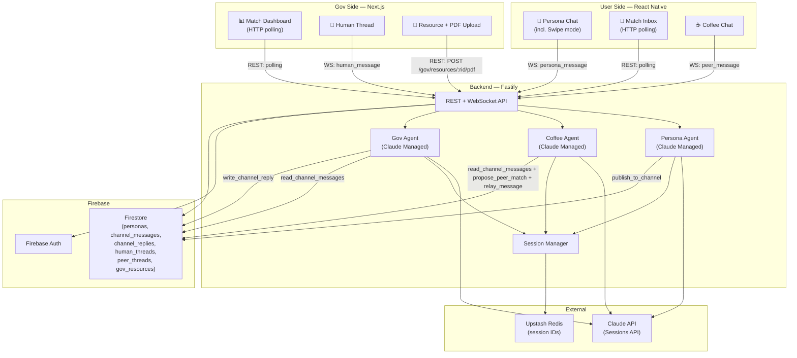

# Matcha: Match with Agent — 黑客松開發計畫

> 將市民與政府資源透過 AI Agent 精準媒合的平台

---

## 產品概述

| 面向 | 說明 |
|------|------|
| 使用者側 | 市民透過對話建立 persona，PersonaAgent 代替他們廣播需求到 channel |
| 政府側 | GovAgent 監聽 channel，回覆廣播並給出 matchScore；政府人員可決定是否開啟真人對話 |
| 媒合機制 | Agent 對 Channel 廣播/回覆，市民查看收到的回覆即知是否被媒合；peer 配對則由 CoffeeAgent 促成 |

---

## 三種訊息類型

| 類型 | 參與者 | 說明 |
|------|--------|------|
| **Persona Chat** | User ↔ PersonaAgent | 使用者與 PersonaAgent 對話，建立並更新 persona |
| **Coffee Chat** | User ↔ CoffeeAgent ↔ User | CoffeeAgent 觀察 channel 配對相似市民，建立 PeerThread 並代理雙方對話 |
| **Channel Matching** | PersonaAgent → Channel ← GovAgent | PersonaAgent 廣播 persona（寫入 channel_messages），GovAgent 回覆並評分；市民定期查看 Match Inbox 知道是否媒合；gov 決定是否開啟真人對話 |

---

## 系統架構



---

## 技術棧

| 層級 | 技術 | 用途 |
|------|------|------|
| User App | React Native + Expo | iOS / Android 市民端 |
| Gov App | Next.js 15 + App Router | 政府 Web Dashboard |
| Backend | Express (Node.js + TypeScript) | API、Agent 呼叫、WebSocket |
| AI | Claude Sessions API (Managed Agents) | Persona / Coffee / Gov Agent |
| Auth | Firebase Auth | 雙端共用登入 |
| DB | Firestore | personas、channel_messages、channel_replies、human_threads、peer_threads、gov_resources |
| Session | Upstash Redis | Agent session ID 映射 |
| Monorepo | pnpm workspaces | 共用型別 |

---

## Monorepo 結構

```
matcha/
├── apps/
│   ├── user/          # Group A — React Native + Expo
│   └── gov/           # Group B — Next.js 15
├── services/
│   └── api/           # Group C — Fastify backend
├── packages/
│   └── shared-types/  # 所有人共用，最先定義
└── pnpm-workspace.yaml
```

---

## 核心資料模型

### Firestore Collections

#### `personas/{uid}`
```typescript
interface UserPersona {
  uid: string
  displayName: string
  summary: string          // PersonaAgent 維護的自然語言摘要
  updatedAt: Timestamp
}
```

#### `channel_messages/{msgId}`
```typescript
interface ChannelMessage {
  msgId: string
  uid: string              // 廣播者市民 uid
  summary: string
  createdAt: Timestamp
}
```

#### `channel_replies/{replyId}`
```typescript
interface ChannelReply {
  replyId: string
  messageId: string        // 指向 channel_messages/{msgId}
  govId: string            // 回覆的政府資源 id
  content: string          // GovAgent 的媒合理由
  matchScore: number       // 0–100
  createdAt: Timestamp
}
```

#### `human_threads/{tid}`
```typescript
interface HumanThread {
  tid: string
  type: "gov_user"
  userId: string
  govId: string            // 承辦人/機關/資源統一用同一個 id
  channelReplyId: string   // 來自哪條 channel_reply
  matchScore: number
  status: "open" | "closed"
  createdAt: Timestamp
  updatedAt: Timestamp
}
```

#### `human_threads/{tid}/messages/{mid}`
```typescript
interface HumanMessage {
  mid: string
  from: string             // "user:{uid}" | "gov_staff:{staffId}"
  content: string
  createdAt: Timestamp
}
```

#### `peer_threads/{tid}`
```typescript
interface PeerThread {
  tid: string
  type: "user_user"
  userAId: string
  userBId: string
  matchRationale: string   // CoffeeAgent 的配對理由
  status: "active" | "closed"
  createdAt: Timestamp
  updatedAt: Timestamp
}
```

#### `peer_threads/{tid}/messages/{mid}`
```typescript
interface PeerMessage {
  mid: string
  from: string             // "user:{uid}" | "coffee_agent"
  content: string
  createdAt: Timestamp
}
```

#### `gov_resources/{rid}`
```typescript
interface GovernmentResource {
  rid: string
  name: string
  description: string
  eligibilityCriteria: string[]
  contactUrl?: string
  pdfStoragePath?: string  // Firebase Storage path，上傳後填入
}
```

---

## Agent 設計

### Session 隔離與 Redis 的角色

Claude Managed Agents 用 **Session** 來維持對話記憶。每次呼叫 Sessions API 都需要帶上 `session_id`，Claude 才能接續前一輪的上下文。

**Redis 的唯一作用**：把 `session_id` 快取起來，讓同一個使用者下次連線時能取回同一個 session，不需要每次重建。

```
Redis key:  session:{agent_type}:{scope_id}     e.g. session:persona:uid_abc
Value:      Claude session_id string             e.g. "sess_01XYZ..."
TTL:        24h（sliding）— session 閒置超過 24h 自動清掉，下次重建新 session

查詢流程：
  1. getOrCreateSession(type, scopeId)
  2.   → Redis GET session:{type}:{scopeId}
  3.   → hit:  直接用這個 session_id 繼續對話
  4.   → miss: 呼叫 Sessions API 建新 session → 把新 session_id 寫回 Redis
```

沒有 Redis，每次 WS 連線都會拿到全新 session（失憶）。有了 Redis，同一個市民的 Persona Agent 在 24h 內都記得前幾輪的對話。

```
Scope by agent type:
  session:persona:{uid}       一位市民對應一個 PersonaAgent session
  session:gov:{govId}         一個政府資源對應一個 GovAgent session
  session:coffee:{tid}        一個 PeerThread 對應一個 CoffeeAgent session（保有雙方脈絡）
```

### Persona Agent

**職責：** 透過對話建立並維護用戶 persona，完成後廣播到 channel。

**觸發方式：** WS `persona_message` 事件（使用者發訊息）。

**Swipe 模式說明：** Swipe 不是一個 tool，而是客戶端的 UI 狀態。使用者切到 Swipe 介面時，客戶端自動送出一條固定的 `persona_message`（例如「請忽略上面的訊息，給我一個二選一的選擇題」）；PersonaAgent 以文字回覆一個選項；使用者選完後離開 Swipe 介面，對話自然恢復正常問答模式。Agent 不需要知道介面狀態，只處理文字輸入。

| Skill | 說明 |
|-------|------|
| `get_my_persona` | 讀取 Firestore personas/{uid} |
| `update_persona` | 寫入 summary 到 Firestore |
| `publish_to_channel` | 寫入 Firestore channel_messages，觸發 GovAgent + CoffeeAgent |

### Gov Agent

**職責：** 讀取新 channel_message，評估媒合度，寫入 ChannelReply。

**觸發方式：** backend 在 publish_to_channel 後主動呼叫（per govId）。

| Skill | 說明 |
|-------|------|
| `read_channel_message` | 讀取 Firestore channel_messages/{msgId} 取得市民 summary |
| `query_resource_pdf` | 讀取該資源的 PDF 文字內容（存於 Firestore），了解資格條件 |
| `assess_fit` | 綜合 persona summary 與資源說明，評估媒合度（0–100）並產生說明文字 |
| `write_channel_reply` | 寫入 Firestore channel_replies（市民定期 HTTP polling 取得） |

### Coffee Agent

**職責：** 觀察 channel_messages，配對相似市民，建立 PeerThread 並代理雙方對話。

**觸發方式：** publish_to_channel 後 backend 觸發（找配對）；WS `peer_message` 時再次呼叫（代理訊息）。

Session key: `session:coffee:{tid}`（per thread，保有雙方對話脈絡）

| Skill | 說明 |
|-------|------|
| `read_channel_messages` | 掃描近期 channel_messages，語意比對找相似 persona summary |
| `propose_peer_match` | 建立 peer_threads 文件（雙方 HTTP polling 發現） |
| `relay_message` | 在 peer_threads/{tid}/messages 寫入訊息，WS 推送給雙方（僅此處用 WS，是 chat 而非通知） |

---

## WebSocket 事件合約

WS is only used for **real-time chat streaming** — not for notifications.
Match/thread discovery is done by HTTP polling.

```typescript
// ── Persona Chat (User ↔ PersonaAgent) ──────────────────────────────
// Swipe 模式：客戶端自行在切入 swipe 介面時送出固定文字指令，
// 不需要額外的 WS event type，PersonaAgent 以純文字回應。

// Client → Server
type PersonaChatEvent =
  | { type: "persona_message"; content: string }

// Server → Client
type PersonaChatReply =
  | { type: "agent_reply"; content: string; done: boolean }

// ── Coffee Chat (User ↔ CoffeeAgent ↔ User) ─────────────────────────

// Client → Server
type PeerChatEvent =
  | { type: "peer_message"; threadId: string; content: string }

// Server → Client (CoffeeAgent relayed/responded via relay_message skill)
type PeerChatReply =
  | { type: "peer_message"; message: PeerMessage }

// ── Human Thread (after gov opens it) ───────────────────────────────

// Client → Server
type HumanChatEvent =
  | { type: "human_message"; threadId: string; content: string }

// Server → Client
type HumanChatReply =
  | { type: "human_message"; message: HumanMessage }
```

> **配對通知、新 thread 出現 → 不走 WS，改用 HTTP polling（見 REST API）**

---

## REST API 端點

```
POST   /auth/verify                       驗證 Firebase token

# ── Persona ──────────────────────────────────────────────────────────
GET    /me/persona                         取得自己的 persona

# ── Polling endpoints（市民定期查詢，不用 WS push）─────────────────────
GET    /me/channel-replies                 [POLL] 查看 GovAgent 媒合回覆列表
GET    /me/peer-threads                    [POLL] 查看 CoffeeAgent 配對的 peer 對話列表
GET    /me/human-threads                   [POLL] 查看 gov 開啟的真人對話列表

# ── Chat messaging（送訊息，WS 負責即時推送到對方）────────────────────
POST   /peer-threads/:tid/messages         在 peer thread 發訊息
POST   /human-threads/:tid/messages        在 human thread 發訊息

# ── Gov Side ─────────────────────────────────────────────────────────
GET    /gov/channel-replies                [POLL] 所有 channel_replies + matchScore（Dashboard）
POST   /gov/channel-replies/:id/open       開啟真人對話（建立 HumanThread，通知市民靠 polling）
GET    /gov/human-threads                  gov 側 human thread 列表
POST   /gov/human-threads/:tid/messages    承辦人在 human thread 發訊息

GET    /gov/resources                      取得資源列表
POST   /gov/resources                      新增資源
POST   /gov/resources/:rid/pdf            上傳 PDF（multipart/form-data）
                                           → 解析文字 → 存入 Firestore gov_resources/{rid}.pdfText
                                           → GovAgent 的 query_resource_pdf 即可讀取
GET    /gov/dashboard                      媒合統計（媒合數、matchScore 分佈、開話率）
```

---

## 三組開發分工

### 分組

| 組別 | 負責 | 主要產出 |
|------|------|----------|
| **Group A** | React Native 市民端 | Persona Chat、Swipe、Match Inbox（channel_replies）、Coffee Chat、Human Thread |
| **Group B** | Next.js 政府端 | 資源管理、Match Dashboard（matchScore）、開啟真人對話、Human Thread |
| **Group C** | Fastify 後端 + Agents | API、Persona Agent、Gov Agent、Coffee Agent、Firebase 整合、WebSocket |

---

### 協作規則

#### Contract-First（最重要）
1. **Day 1 AM，Group C 必須先鎖定 `shared-types/index.ts`**
2. 任何 interface 改動需在群組通知，避免 A/B 對著舊合約開發
3. mock server 回傳型別必須與 shared-types 一致

#### Mock Server（Group C 提供）
```typescript
// 讓 Group A/B Day 1 下午就能開始串接
GET  /me/persona               → 回傳假的 UserPersona
GET  /me/channel-replies       → 回傳 2 個假的 ChannelReply（含 matchScore）
GET  /me/peer-threads          → 回傳 1 個假的 PeerThread
GET  /gov/channel-replies      → 同上（政府視角）
WS   /ws                       → 每 3 秒推一個假 peer_message / human_message（chat only）
```

#### 整合時序
```
Day 1 PM：A/B 對 mock server 開發 UI
Day 2 AM：Group C 喊「Persona Agent 上線」→ Group A 切換到真實端點
Day 2 PM：Group C 喊「Gov Agent + Coffee Agent 上線」→ Group B 切換到真實端點
```

#### 分支策略
```
main
├── feat/mobile-*     (Group A)
├── feat/web-*        (Group B)
└── feat/api-*        (Group C)

shared-types 改動 → PR → 所有人 review → merge to main
```

---

## 黑客松 Demo Flow（Happy Path）

```
Path 1 — Gov Match
  1. 市民登入（RN）→ Persona Agent 問 3 個問題
  2. 市民在 Swipe 介面選幾輪 → PersonaAgent publish_to_channel → Firestore channel_messages
  3. GovAgent（per govId）query_resource_pdf → assess_fit → write_channel_reply（matchScore: 87）
  4. 市民刷新 Match Inbox（HTTP polling）→ 出現「青年創業補助計畫 — 配對度 87%」
  5. Gov Dashboard（HTTP polling）顯示這筆 channel_reply + matchScore
  6. 承辦人點「開啟對話」→ POST /gov/channel-replies/:id/open → HumanThread 建立
  7. 市民刷新 human-threads → 進入 HumanThread → WS human_message 即時聊天

Path 2 — Coffee Chat
  1. 市民 A 登入 → 建 persona → PersonaAgent 廣播 → Firestore channel_messages
  2. CoffeeAgent 掃描 channel_messages，找到相似市民 B → addDoc peer_threads
  3. 市民 A/B 各自 polling GET /me/peer-threads 發現新對話
  4. 雙方進入 Coffee Chat → WS peer_message 即時傳訊，CoffeeAgent 代理轉發
```

---

## 可砍功能（時間不夠時）

| 功能 | 可砍？ | 替代方案 |
|------|--------|----------|
| FCM Push | ✅ 可砍 | 改成 WebSocket 通知，不影響 demo |
| Swipe UI | ✅ 可砍 | 改成純對話式問答（PersonaAgent 不感知差異，客戶端邏輯而已） |
| Gov Dashboard 統計圖 | ✅ 可砍 | channel_replies 列表仍可 demo |
| Coffee Agent | ❌ 不可砍 | 主打功能 |
| Gov Agent 媒合 | ❌ 不可砍 | 核心功能 |
| Persona Agent | ❌ 不可砍 | 所有功能的前提 |
| Channel Reply → Human Thread | ❌ 不可砍 | Gov 開對話是整個 demo 的高潮 |

---

## Agent Implementation Plan (Group C — Day 1 PM)

### What is a Managed Agent?

| Component | Created | Lifecycle | Purpose |
|-----------|---------|-----------|---------|
| **Environment** | Once at boot | Persists until archived | Cloud container config |
| **Agent** | Once at boot | Versioned, persists | Model + system prompt + tools |
| **Session** | Per user, lazily | 24h (Redis TTL) | Running conversation with checkpointed container |

```
One-time setup (first boot)
  └── Create Environment: matcha-api
  └── Create Persona Agent (ID → PERSONA_AGENT_ID in .env)
  └── Create Coffee Agent  (ID → COFFEE_AGENT_ID  in .env)
  └── Create Gov Agent     (ID → GOV_AGENT_ID     in .env)

Per user/thread, lazy (Redis cache)
  └── session:persona:{uid}      → Claude session ID
  └── session:coffee:{tid}       → Claude session ID (per peer_thread, holds both users' context)
  └── session:gov:{resourceId}   → Claude session ID (per gov resource)
```

---

### Persona Agent

**Invocation flow** (per `persona_message` WS event):
```
WS: persona_message { content }
  → getOrCreateSession('persona', uid)
  → sessions.events.stream(sid)
  → sessions.events.send({ user.message })
  → for event of stream:
      agent.message         → WS: agent_reply { content, done: false }
      agent.custom_tool_use → executePersonaTool(name, input, uid)
        publish_to_channel  → Firestore addDoc channel_messages
                            → triggerGovAgent(msgId, summary)
                            → triggerCoffeeMatch(msgId, uid, summary)
      session.status_idle   → WS: agent_reply { done: true }
```

---

### Gov Agent

**Invocation flow** (triggered by backend after publish_to_channel, once per gov resource):
```
triggerGovAgent(msgId, summary)
  → for each active gov_resource:
      getOrCreateSession('gov', govId)
      sessions.events.send({
        user.message: "New channel message from citizen: {summary}"
      })
      → agent calls query_resource_pdf()  → reads resource description + eligibility from Firestore
      → agent calls assess_fit()          → returns score 0-100 + rationale
      → agent calls write_channel_reply({ messageId: msgId, govId, matchScore, content })
          → Firestore addDoc channel_replies
          (citizen discovers via HTTP polling GET /me/channel-replies)
```

---

### Coffee Agent

**Invocation flow A** — triggered after publish_to_channel (find match):
```
triggerCoffeeMatch(msgId, uid, summary)
  → getOrCreateSession('coffee', newTid)
  → sessions.events.send({
      user.message: "New citizen: {summary}. Read recent channel messages and find a semantic match."
    })
  → agent calls read_channel_messages()   → returns recent summaries from other users
  → if match found:
      agent calls propose_peer_match({ userAId, userBId, matchRationale })
          → Firestore addDoc peer_threads/{tid}
          (both users discover via HTTP polling GET /me/peer-threads)
```

**Invocation flow B** — triggered by WS `peer_message` (proxy chat):
```
WS: peer_message { threadId, content, fromUid }
  → getOrCreateSession('coffee', threadId)   ← same session as flow A, has full context
  → sessions.events.send({ user.message: "userA says: {content}" })
  → agent calls relay_message({ content, role: "relay" | "facilitate" })
      → Firestore addDoc peer_threads/{tid}/messages
      → WS push peer_message to both users in thread
```

---

### File Structure

```
services/api/src/
├── lib/
│   ├── anthropic.ts     ← Anthropic client singleton
│   ├── redis.ts
│   ├── session.ts
│   └── firestore.ts     ← CRUD helpers (to be built Day 1)
└── agents/
    ├── setup.ts         ← one-time environment + agent creation
    ├── tools.ts         ← custom tool definitions + handlers
    ├── persona.ts       ← invokePersonaAgent()
    ├── gov.ts           ← triggerGovAgent()
    └── coffee.ts        ← triggerCoffeeMatch()
```

New env vars:
```
MANAGED_ENV_ID=env_...
PERSONA_AGENT_ID=agent_...
COFFEE_AGENT_ID=agent_...
GOV_AGENT_ID=agent_...
```

---

### Custom Tool Handlers (tools.ts)

| Tool | Agent | Executes |
|------|-------|----------|
| `get_my_persona` | Persona | `getDoc('personas', uid)` |
| `update_persona` | Persona | `setDoc('personas', uid, { summary })` |
| `publish_to_channel` | Persona | `addDoc('channel_messages', { uid, summary })` → trigger Gov + Coffee |
| `query_resource_pdf` | Gov | read `gov_resources/{rid}.pdfText` from Firestore |
| `assess_fit` | Gov | return numeric score 0–100 + rationale (no tool, pure agent reasoning) |
| `write_channel_reply` | Gov | `addDoc('channel_replies', { messageId, govId, content, matchScore })` |
| `read_channel_messages` | Coffee | `getDocs('channel_messages', orderBy createdAt desc, limit 50)` |
| `propose_peer_match` | Coffee | `addDoc('peer_threads', { userAId, userBId, matchRationale })` |
| `relay_message` | Coffee | `addDoc('peer_threads/{tid}/messages', ...)` + WS push to both users |

---

## 待完成項目（Group C）

目前 API server 以 in-memory store 運作，尚未接 Firebase / 真實 Agents。以下為需補完的檔案：

### 新建

| 檔案 | 內容 |
|------|------|
| `lib/firestore.ts` | Firestore CRUD helpers（`getDoc`, `setDoc`, `addDoc`, `getDocs`），供 routes 和 tool wrappers 共用；建完後可刪除 `lib/store.ts` |

### 修改

| 檔案 | 待做事項 |
|------|---------|
| `middleware/auth.ts` | 改用 `getAuth().verifyIdToken(idToken)`；role 從 Firestore `/gov_staff/{uid}` 查 |
| `routes/auth.ts` | 同上，`POST /auth/verify` 改驗 Firebase token |
| `ws/handler.ts` | `handlePersonaMessage` 改呼叫 `invokePersonaAgent()`，移除 canned reply |
| `agents/user/persona.ts` | 實作 `invokePersonaAgent()`：getOrCreateSession → Sessions API stream → 處理 custom_tool_use → WS push `agent_reply` |
| `agents/user/tools.ts` | 所有 tool handler 改讀寫 Firestore（`get_my_persona`, `update_persona`, `publish_to_channel`）；`publish_to_channel` 完成後呼叫 `triggerGovAgent` + `triggerCoffeeMatch` |
| `agents/user/coffee.ts` | 實作 `triggerCoffeeMatch()`：Sessions API → read_channel_messages → propose_peer_match → 寫 Firestore `peer_threads` |
| `agent/gov/toolWrappers/readChannel.ts` | 改從 Firestore `channel_messages` 查詢，移除 fakeData 依賴 |
| `agent/gov/toolWrappers/queryProgramDocs.ts` | 改從 Firestore `gov_resources/{rid}.pdfText` 讀取 |
| `agent/gov/toolWrappers/proposeMatch.ts` | 改寫入 Firestore `channel_replies`，移除 mock 物件 |

### 已完成，只需填 .env

| 檔案 | 說明 |
|------|------|
| `lib/redis.ts` | 需填 `UPSTASH_REDIS_URL` |
| `lib/session.ts` | getSession / setSession 已實作 |
| `agents/user/setup.ts` | `initAgents()` 一次性建立 managed agents，跑完把 ID 填入 `.env` |
| `agent/gov/managedAgent.ts` | `initGovManagedAgentSession()` 已實作 |
