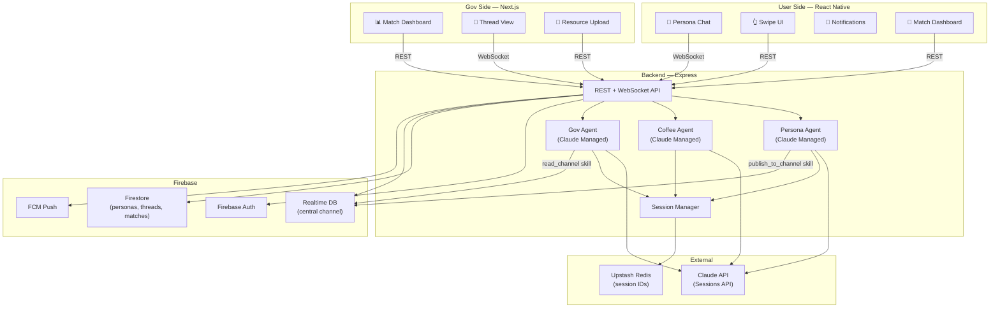

# Matcha: Match with Agent — 黑客松開發計畫

> 將市民與政府資源透過 AI Agent 精準媒合的平台

---

## 產品概述

| 面向 | 說明 |
|------|------|
| 使用者側 | 市民透過對話建立 persona，Agent 代替他們與政府資源媒合 |
| 政府側 | 各機關 Agent 持續監聽 channel，主動找符合的市民 |
| 媒合機制 | Agent 對 Agent 協商，雙方真人皆可隨時介入 |

---

## 系統架構



---

## 技術棧

| 層級 | 技術 | 用途 |
|------|------|------|
| User App | React Native + Expo | iOS / Android 市民端 |
| Gov App | Next.js 15 + App Router | 政府 Web Dashboard |
| Backend | Express (Node.js + TypeScript) | API、Agent 呼叫、WebSocket |
| AI | Claude Sessions API (Managed Agents) | Persona / Coffee / Gov Agent |
| Auth | Firebase Auth | 雙端共用登入 |
| DB | Firestore | persona、thread、match、resource 持久化 |
| Channel | Firebase Realtime DB | persona 廣播 (ephemeral) |
| Push | FCM | 配對通知 fallback |
| Session | Upstash Redis | Agent session ID 映射 |
| Monorepo | pnpm workspaces | 共用型別 |

---

## Monorepo 結構

```
matcha/
├── apps/
│   ├── user/          # Group A — React Native + Expo
│   └── gov/             # Group B — Next.js 15
├── services/
│   └── api/             # Group C — Express backend
├── packages/
│   └── shared-types/    # 所有人共用，最先定義
└── pnpm-workspace.yaml
```

---

## 核心資料模型

### UserPersona
```typescript
interface UserPersona {
  uid: string
  displayName: string
  summary: string          // Agent 維護的自然語言摘要
  tags: string[]           // 結構化標籤，供 Gov Agent 快速過濾
  updatedAt: Timestamp
}
```

### ChannelBroadcast (Realtime DB)
```typescript
interface ChannelBroadcast {
  uid: string
  summary: string
  tags: string[]
  publishedAt: number      // unix ms
}
```

### AgentThread
```typescript
interface AgentThread {
  tid: string
  type: "gov_user" | "user_user"
  initiatorId: string      // "gov:{resourceId}" | "user:{uid}"
  responderId: string      // "user:{uid}"
  status: "negotiating" | "matched" | "rejected" | "human_takeover"
  userPresence: "agent" | "human" | "both"
  govPresence:  "agent" | "human" | "both"
  matchScore?: number      // Agent 主觀評估，僅供顯示
  createdAt: Timestamp
  updatedAt: Timestamp
}
```

### ThreadMessage
```typescript
interface ThreadMessage {
  mid: string
  tid: string
  from: string             // "persona_agent:{uid}" | "gov_agent:{rid}" | "human:{uid}"
  type: "query" | "answer" | "decision" | "human_note"
  content: Record<string, unknown>
  createdAt: Timestamp
}
```

### GovernmentResource
```typescript
interface GovernmentResource {
  rid: string
  agencyId: string
  name: string
  description: string
  eligibilityCriteria: string[]
  tags: string[]
  contactUrl?: string
}
```

---

## Agent 設計

### Session 隔離

```
Redis key:  session:{agent_type}:{uid}
Value:      Claude session_id (string)
TTL:        24h sliding

同一個 Agent 型別，所有人共用同一個 system prompt，
但每個人有獨立的 session_id → 獨立記憶與狀態。
```

### Persona Agent

**職責：** 透過對話與 swipe 建立並維護用戶 persona

| Skill | 說明 |
|-------|------|
| `ask_question` | 以對話形式詢問用戶背景、需求 |
| `present_swipe` | 回傳左右滑卡片選項 |
| `update_persona` | 寫入 Firestore UserPersona |
| `publish_to_channel` | 將 persona 廣播到 Realtime DB |
| `get_my_persona` | 讀取當前 persona |
| `request_human_review` | 標記需要真人客服 |
| `reply_if_asked` | thread 中被問到時被動回答 |
| `summarize_thread` | 為真人介入前生成摘要 |

### Gov Agent

**職責：** 監聽 channel、判斷是否媒合、主動發起協商

| Skill | 說明 |
|-------|------|
| `read_channel` | 讀取最新 persona 廣播 |
| `query_program_docs` | 查詢本機關資源文件 |
| `check_eligibility` | 根據 persona 判斷資格 |
| `assess_fit` | 評估媒合度（0–100 主觀分） |
| `propose_match` | 在 Firestore 建立 AgentThread |
| `notify_user` | 送 FCM 通知給市民 |
| `escalate_to_caseworker` | 升級給真人承辦人 |
| `request_human_review` | 同上 |
| `reply_if_asked` | 被 Persona Agent 詢問時回答 |
| `summarize_thread` | 真人介入前摘要 |

### Coffee Agent (P2 — 市民互助)

**職責：** 找到 persona 相似的其他市民，促成交流

| Skill | 說明 |
|-------|------|
| `search_peers` | 以 tags 查 Firestore 找相似用戶 |
| `propose_peer_match` | 建立 user_user AgentThread |
| `open_chat` | 啟動雙方對話 |
| `request_human_review` | 同上 |
| `summarize_thread` | 同上 |

---

## 人工介入邏輯

```
userPresence / govPresence 各自獨立追蹤

┌─────────────────┬──────────────────┬─────────────────────────────┐
│ userPresence    │ govPresence      │ 行為                        │
├─────────────────┼──────────────────┼─────────────────────────────┤
│ agent           │ agent            │ 雙方 Agent 自主協商          │
│ human           │ agent            │ 市民直接輸入，Gov Agent 回應  │
│ agent           │ human            │ Persona Agent 回應，承辦人打字│
│ human           │ human            │ 雙方靜音，真人直接對話        │
└─────────────────┴──────────────────┴─────────────────────────────┘

任一方真人加入 → 對應 Agent 進入被動模式
雙方都是真人 → Agent 完全靜音（除非被 @tag）
```

---

## WebSocket 事件合約

```typescript
// Client → Server
type ClientEvent =
  | { type: "chat_message"; content: string }
  | { type: "swipe"; direction: "left" | "right"; cardId: string }
  | { type: "human_join"; threadId: string }
  | { type: "human_leave"; threadId: string }
  | { type: "thread_message"; threadId: string; content: string }

// Server → Client
type ServerEvent =
  | { type: "agent_reply"; content: string; done: boolean }
  | { type: "swipe_card"; card: SwipeCard }
  | { type: "match_notify"; thread: AgentThread }
  | { type: "thread_update"; thread: AgentThread }
  | { type: "thread_message"; message: ThreadMessage }
  | { type: "presence_update"; threadId: string; userPresence: string; govPresence: string }
```

---

## REST API 端點

```
POST   /auth/verify              驗證 Firebase token

GET    /me/persona               取得自己的 persona
POST   /me/chat                  送訊息給 Persona Agent (streaming)
POST   /me/swipe                 提交 swipe 選擇

GET    /threads                  列出我的 threads
GET    /threads/:tid             取得 thread 詳情
POST   /threads/:tid/join        真人加入
POST   /threads/:tid/leave       真人離開
POST   /threads/:tid/message     在 thread 發訊息

GET    /gov/resources            取得機關資源列表
POST   /gov/resources            新增資源（政府用）
GET    /gov/threads              政府側 thread 列表
GET    /gov/dashboard            媒合統計數據
```

---

## 三組開發分工

### 分組

| 組別 | 負責 | 主要產出 |
|------|------|----------|
| **Group A** | React Native 市民端 | Persona Chat、Swipe、Match Dashboard、**Coffee Chat**、通知 |
| **Group B** | Next.js 政府端 | 資源管理、Thread 監控、統計 Dashboard、承辦人介入 |
| **Group C** | Express 後端 + Agents | API、Persona Agent、Gov Agent、**Coffee Agent**、Firebase 整合、WebSocket |

---

### 開發時間軸（2 天黑客松）

> **核心原則：** Group C Day 1 上午鎖定 shared-types + 啟動 mock server，A/B 立刻並行開發，不等後端。

```
開賽前（自行完成）
└── 所有人：clone monorepo、安裝 pnpm、設定環境、讀 shared-types

━━━━━━━━━━━━━━━━━━━━━━━━━━━━━━━━━━━ Day 1 ━━━━━━━━━━━━━━━━━━━━━━━━━━━━━━━━━━━

Group C【最高優先 — 上午完成才能解鎖 A/B】
├── AM-早：確認並鎖定 shared-types/index.ts（任何改動先在群組討論）
├── AM-早：啟動 mock server（port 3001，所有端點回假資料 + mock WS 推事件）
├── AM-晚：Firebase 初始化、Auth middleware、Firestore CRUD helpers
└── PM：Persona Agent 接通（Claude Sessions API + Redis session）
     + publish_to_channel skill（Realtime DB 廣播）

Group A（mock server 一上線立刻開幹）
├── AM：Expo 專案建立 + Firebase Auth 登入頁
├── PM-早：Persona Chat UI（WebSocket streaming 接 mock）
└── PM-晚：Swipe UI 元件（接 mock swipe_card 事件）

Group B（mock server 一上線立刻開幹）
├── AM：Next.js 專案建立 + Firebase Auth 登入頁（gov_staff role）
├── PM-早：Thread 列表頁 + Thread 詳情頁（接 mock REST）
└── PM-晚：資源列表頁、新增資源表單

━━━━━━━━━━━━━━━━━━━━━━━━━━━━━━━━━━━ Day 2 ━━━━━━━━━━━━━━━━━━━━━━━━━━━━━━━━━━━

Group C
├── AM-早：Gov Agent 接通（read_channel → assess_fit → propose_match → FCM）
├── AM-晚：Coffee Agent 接通（search_peers → propose_peer_match）
│          Human intervention：presence flag 切換邏輯
└── PM：Gov dashboard 統計 API、bug fix、協助 A/B 串接問題

Group A
├── AM-早：切換到真實後端（關掉 mock flag）
│          Match Dashboard — gov_user thread 列表 + 真人加入按鈕
├── AM-晚：Coffee Chat UI — peer_notify 接收、peer thread 列表
└── PM：通知接收（FCM）、UI polish、Demo flow 走一遍

Group B
├── AM-早：切換到真實後端
│          Thread 詳情 — presence badge、承辦人介入按鈕
├── AM-晚：Gov dashboard 統計頁（媒合數、真人介入率、tag 分佈）
└── PM：UI polish、Demo flow 走一遍

━━━━━━━━━━━━━━━━━━━━━━━━━━━━━━━━━━ Demo Prep ━━━━━━━━━━━━━━━━━━━━━━━━━━━━━━━━

確認兩條 happy path 都能走通：
  Path 1：登入 → 建 persona → Gov Agent 媒合 → 市民介入 → 承辦人介入 → 真人對話
  Path 2：登入 → 建 persona → Coffee Agent 配對 → 兩位市民 Agent 協商 → 真人加入聊天
```

---

### 協作規則

#### Contract-First（最重要）
1. **Day 1 AM，Group C 必須先鎖定 `shared-types/index.ts`**
2. 任何 interface 改動需在群組通知，避免 A/B 對著舊合約開發
3. mock server 回傳型別必須與 shared-types 一致

#### Mock Server（Group C 提供）
```typescript
// 讓 Group A/B Day 1 下午就能開始串接
GET  /me/persona       → 回傳假的 UserPersona
POST /me/chat          → SSE stream 回傳假的 agent_reply
GET  /threads          → 回傳 2 個假的 AgentThread
GET  /gov/threads      → 同上（政府視角）
WS   /ws               → 每 3 秒推一個假 server event
```

#### 整合時序
```
Day 1 PM：A/B 對 mock server 開發 UI
Day 2 AM：Group C 喊「Persona Agent 上線」→ Group A 切換到真實端點
Day 2 PM：Group C 喊「Gov Agent 上線」→ Group B 切換到真實端點
Day 3 AM：全員對真實後端，不再用 mock
```

#### 分支策略
```
main
├── feat/mobile-*     (Group A)
├── feat/web-*        (Group B)
└── feat/api-*        (Group C)

shared-types 改動 → PR → 所有人 review → merge to main
```

---

## 黑客松 Demo Flow（Happy Path）

```
1. 市民登入（RN）→ Persona Agent 問 3 個問題
2. 市民完成 swipe → Persona Agent publish_to_channel
3. Gov Agent read_channel → assess_fit → propose_match
4. 市民收到推播通知 → 進入 Match Dashboard
5. 點開 thread → 看到 Agent 協商訊息
6. 市民點「加入對話」→ userPresence = "human"
7. 市民和政府 Agent（或承辦人）直接對話
8. Gov 承辦人點「接手」→ govPresence = "human"
9. 雙方真人直接溝通 → status = "human_takeover"
```

---

## 可砍功能（時間不夠時）

> Coffee Chat 是主打功能，**不可砍**。

| 功能 | 可砍？ | 替代方案 |
|------|--------|----------|
| FCM Push | ✅ 可砍 | 改成 WebSocket 通知，不影響 demo |
| Swipe UI | ✅ 可砍 | 改成純對話式問答，Persona Agent 照常運作 |
| Gov Dashboard 統計 | ✅ 可砍 | Thread 列表仍可 demo |
| 真人介入（雙向） | ⚠️ 部分可砍 | 只做市民側介入，Gov Agent 那側保持 agent 模式 |
| Coffee Agent | ❌ 不可砍 | 主打功能 |
| Gov Agent 媒合 | ❌ 不可砍 | 核心功能 |
| Persona Agent | ❌ 不可砍 | 所有功能的前提 |
