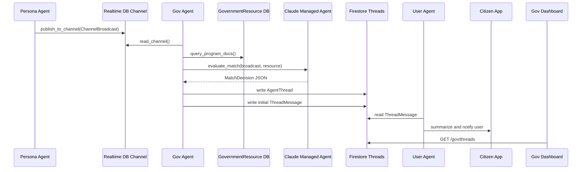

# MATCHA Gov Agent SDD

> SDD = Software Design Document。這份文件說明 Government Agent 要做什麼、為什麼要這樣做、要先做哪些假資料，以及最小可行 pipeline。

## 1. 這個 Agent 要解決什麼問題

MATCHA 的核心想法是「資源主動找到人」，不是讓青年自己去政府網站搜尋。

Gov Agent 負責代表某個政府資源，例如「青年就業促進計畫」、「文組轉職培訓補助」、「職涯探索諮詢」，去監聽 Persona Agent 發出的使用者狀態廣播。當它發現某個使用者可能符合資源條件時，就主動建立媒合 thread，讓市民端收到通知，也讓政府端承辦人可以追蹤或介入。

用一句話說：

> Gov Agent = 會自己找適合使用者的政府資源代理人。

## 2. MVP 範圍

黑客松階段先不要做太複雜。Gov Agent 的 MVP 只需要完成這條主流程：

1. 讀取 Persona Agent 廣播出來的 `ChannelBroadcast`
2. 讀取本機關可用的 `GovernmentResource`
3. 把 persona + resource 交給 Claude Managed Agent 判斷媒合
4. 讓 Claude 回傳固定 JSON，包含 `eligible`、`score`、`reason`、`missingInfo`
5. 如果分數夠高，建立 `AgentThread`
6. 同時建立第一則 `ThreadMessage`
7. 將 `AgentThread` 與 `ThreadMessage` 寫入 database
8. 由 User Agent 讀取 `ThreadMessage`，整理成通知或 App 內摘要給使用者

暫時可以不做：

- 完整 RAG 向量搜尋
- Firebase FCM 推播
- 多 Agent 排程系統
- 複雜的政府權限控管

這一版會直接用 `claude-haiku-4-5` 做媒合判斷，不用簡單規則代替。Pipeline 本身只負責資料流、呼叫 Claude Managed Agent、解析結果，並建立 thread + initial message。

## 3. Gov Agent 在系統中的位置



Gov Agent 最早只需要做到：

- `read_channel`
- `query_program_docs`
- `init_managed_agent`
- `evaluate_match_with_claude`

等這四件事能跑，再接：

- `propose_match`
- User Agent notification handoff
- `reply_if_asked`
- `summarize_thread`

### 3.1 Markdown Skill-first 原則

本文件中 `skill` 統一指 **Markdown Skill**，也就是放在 `skills/<skill_name>/SKILL.md` 的能力說明文件。它不是 TypeScript function，也不是 MCP tool。

Gov Agent 盡量不要直接在 agent prompt 或 pipeline 裡寫死資料存取邏輯。建議把所有「會碰外部世界」的能力都描述成 Markdown Skill，讓 Claude Managed Agent 依照 `SKILL.md` 的指引去呼叫 tool wrapper、API 或 MCP server。

也就是：

```txt
Gov Agent 負責：
- 理解 persona
- 理解政府資源
- 判斷是否媒合
- 決定下一步要呼叫哪個 skill

Markdown Skill 負責：
- 說明何時使用這個能力
- 定義 input / output contract
- 告訴 Agent 應該呼叫哪個 tool wrapper 或 MCP tool
- 說明錯誤處理與注意事項

Tool Wrapper 負責：
- 執行 TypeScript function
- 讀 fake data / Firebase / Firestore
- 建立 draft thread 或寫入 Firestore
- 送 WebSocket / FCM 通知
- 呼叫 MCP tool 或 RAG
```

這樣做的好處：

- Agent 的推理邏輯和系統 I/O 分離
- 之後要把 fake data 換成 Firebase，只要改 tool wrapper
- 之後要把本地函式換成 MCP server，只要改 Markdown Skill 指向的 tool target
- 每個 tool wrapper 都可以獨立測試與除錯
- Claude Managed Agent 可以專注在「何時呼叫哪個能力」與「如何解讀結果」

## 4. 會用到的 shared types

目前專案的共用型別放在：

```txt
packages/shared-types/src/index.ts
```

Gov Agent 會主要用到這幾個型別：

```ts
import type {
  ChannelBroadcast,
  GovernmentResource,
  AgentThread,
  ThreadMessage,
  ServerEvent,
} from '@matcha/shared-types'
```

### 4.1 ChannelBroadcast

`ChannelBroadcast` 是 Persona Agent 發到中央頻道的去識別化使用者狀態。

```ts
export interface ChannelBroadcast {
  uid: string
  displayName: string
  persona: string
  tags: string[]
  needs: string[]
  publishedAt: number
}
```

Gov Agent 不需要知道使用者全部個資，只要讀這份摘要即可。

欄位意思：

- `uid`：使用者 id，之後建立 thread 時會用到
- `displayName`：顯示名稱，demo 可以直接顯示
- `persona`：Persona Agent 整理出的自然語言摘要
- `tags`：結構化標籤，例如 `青年`、`就業`、`設計`
- `needs`：使用者目前想找的幫助，例如 `職業培訓`
- `publishedAt`：廣播時間，避免重複處理舊資料

### 4.2 GovernmentResource

`GovernmentResource` 是政府端建立的資源資料。

```ts
export interface GovernmentResource {
  rid: string
  agencyId: string
  agencyName: string
  name: string
  description: string
  eligibilityCriteria: string[]
  tags: string[]
  contactUrl?: string
  createdAt: number
}
```

欄位意思：

- `rid`：資源 id，例如 `rid-youth-career-001`
- `agencyId`：機關 id，例如 `taipei-youth-dept`
- `agencyName`：機關名稱
- `name`：資源名稱
- `description`：資源說明
- `eligibilityCriteria`：申請條件或適用對象
- `tags`：資源標籤，用於初步比對
- `contactUrl`：申請或說明頁
- `createdAt`：建立時間

### 4.3 AgentThread

`AgentThread` 是媒合成功後建立的對話 thread。

```ts
export interface AgentThread {
  tid: string
  type: 'gov_user' | 'user_user'
  initiatorId: string
  responderId: string
  status: 'negotiating' | 'matched' | 'rejected' | 'human_takeover'
  matchScore?: number
  summary?: string
  userPresence: 'agent' | 'human' | 'both'
  govPresence: 'agent' | 'human' | 'both'
  peerPresence?: 'agent' | 'human' | 'both'
  govStaffUid?: string
  createdAt: number
  updatedAt: number
}
```

欄位意思：

- `tid`：thread id，代表這一條媒合對話的唯一識別碼。
- `type`：thread 類型。`gov_user` 表示政府資源和市民的媒合；`user_user` 表示 Coffee Chat 的市民對市民媒合。
- `initiatorId`：發起方 id。Gov Agent 建立媒合時會是 `gov:{resourceId}`；Coffee Chat 可能會是 `user:{uid}`。
- `responderId`：回應方 id。政府媒合時通常是 `user:{uid}`，代表被媒合到的市民。
- `status`：thread 目前狀態。`negotiating` 表示 Agent 正在協商；`matched` 表示已確認媒合；`rejected` 表示不適合或被拒絕；`human_takeover` 表示真人已接手。
- `matchScore`：Claude 給出的 0 到 100 媒合分數，只供前端顯示與排序參考，不應當成唯一決策依據。
- `summary`：Agent 產生的 thread 摘要，例如媒合理由、目前缺少哪些資訊，或真人接手前的重點整理。
- `userPresence`：市民這一側目前由誰在回應。`agent` 表示 Persona Agent 代理；`human` 表示市民真人加入；`both` 表示真人和 Agent 都可參與。
- `govPresence`：政府這一側目前由誰在回應。`agent` 表示 Gov Agent 代理；`human` 表示承辦人加入；`both` 表示承辦人和 Gov Agent 都可參與。
- `peerPresence`：Coffee Chat 用欄位，表示另一位市民那側的 presence。`gov_user` thread 通常不需要這個欄位。
- `govStaffUid`：政府承辦人 uid。當承辦人加入 thread 時記錄，用來推送 WebSocket 事件或顯示目前由誰接手。
- `createdAt`：thread 建立時間，使用 unix ms。
- `updatedAt`：thread 最後更新時間，使用 unix ms。

Gov Agent 建立政府媒合時，固定使用：

```ts
type: 'gov_user'
initiatorId: `gov:${resource.rid}`
responderId: `user:${broadcast.uid}`
status: 'negotiating'
userPresence: 'agent'
govPresence: 'agent'
```

## 5. 預先要做的東西

在接 Firebase 或 RAG 之前，先建立一份 fake data。這樣可以讓你用 Claude Managed Agent 測完整 pipeline，也讓 mobile / web 組可以先串 UI。

建議先放在：

```txt
services/api/src/agent/gov/fakeData.ts
```

如果資料要共用給 mock server，也可以之後移到 `packages/shared-types` 或 `services/api/src/mock`。

### 5.1 Fake ChannelBroadcast

```ts
import type { ChannelBroadcast } from '@matcha/shared-types'

export const fakeChannelBroadcasts: ChannelBroadcast[] = [
  {
    uid: 'user-xiaoya-001',
    displayName: '小雅',
    summary: '中文系大三，對品牌設計、排版和文組轉職有興趣，目前想找實習或職涯探索資源。',
    tags: ['青年', '文組轉職', '設計', '實習', '職涯探索'],
    needs: ['職涯諮詢', '實習媒合', '職業培訓'],
    publishedAt: Date.now() - 60_000,
  },
  {
    uid: 'user-ming-002',
    displayName: '阿明',
    summary: '剛退伍，想找穩定工作，對餐飲、門市和政府職訓補助有興趣。',
    tags: ['青年', '就業', '職訓', '補助'],
    needs: ['就業輔導', '職業培訓'],
    publishedAt: Date.now() - 30_000,
  },
  {
    uid: 'user-lin-003',
    displayName: '小林',
    summary: '正在準備創業，想了解青年創業貸款、商業模式輔導和政府補助。',
    tags: ['青年', '創業', '貸款', '補助'],
    needs: ['創業輔導', '資金補助'],
    publishedAt: Date.now() - 10_000,
  },
]
```

### 5.2 Fake GovernmentResource

```ts
import type { GovernmentResource } from '@matcha/shared-types'

export const fakeGovernmentResources: GovernmentResource[] = [
  {
    rid: 'rid-youth-career-001',
    agencyId: 'taipei-youth-dept',
    agencyName: '臺北市青年局',
    name: '青年職涯探索諮詢',
    description: '提供青年職涯方向探索、履歷健檢、面試準備與一對一職涯諮詢。',
    eligibilityCriteria: ['設籍或就學就業於臺北市', '年齡 18 至 35 歲青年', '對職涯方向或轉職有諮詢需求'],
    tags: ['青年', '職涯探索', '就業', '諮詢'],
    contactUrl: 'https://example.gov.taipei/youth-career',
    createdAt: Date.now(),
  },
  {
    rid: 'rid-design-intern-002',
    agencyId: 'taipei-youth-dept',
    agencyName: '臺北市青年局',
    name: '創意產業實習媒合計畫',
    description: '媒合對設計、品牌、內容企劃有興趣的青年進入創意產業實習。',
    eligibilityCriteria: ['大專院校學生或畢業三年內青年', '對設計、品牌、內容產業有興趣', '可投入至少兩個月實習'],
    tags: ['青年', '設計', '實習', '品牌', '職涯探索'],
    contactUrl: 'https://example.gov.taipei/design-intern',
    createdAt: Date.now(),
  },
  {
    rid: 'rid-youth-startup-003',
    agencyId: 'taipei-youth-dept',
    agencyName: '臺北市青年局',
    name: '青年創業輔導與貸款說明',
    description: '提供青年創業前期諮詢、商業模式輔導、創業貸款說明與補助資訊。',
    eligibilityCriteria: ['年齡 20 至 45 歲', '有創業構想或已成立公司', '需要資金、商業模式或法規諮詢'],
    tags: ['青年', '創業', '貸款', '補助', '諮詢'],
    contactUrl: 'https://example.gov.taipei/startup',
    createdAt: Date.now(),
  },
]
```

## 6. 最小 Pipeline 設計

第一版 pipeline 仍然不要一開始就接 cron、queue 或 WebSocket，但因為媒合判斷要交給 Claude Managed Agent，所以 pipeline 會是 `async`。

Claude Managed Agents 的概念是：先建立一個 Agent，再建立 Environment，最後建立 Session，之後透過 session events 把任務送進去，並讀取 agent 回傳。這很適合 Gov Agent，因為政府資源媒合屬於背景、非同步、可能長時間持續執行的工作。

參考文件：[Claude Managed Agents overview](https://platform.claude.com/docs/en/managed-agents/overview)。

建議檔案：

```txt
services/api/src/agent/gov/
├── fakeData.ts
├── managedAgent.ts
├── toolWrappers/
│   ├── readChannel.ts
│   ├── queryProgramDocs.ts
│   ├── proposeMatch.ts
│   └── index.ts
├── skills/
│   ├── read_channel/SKILL.md
│   ├── query_program_docs/SKILL.md
│   ├── propose_match/SKILL.md
│   ├── notify_user/SKILL.md
│   └── escalate_to_caseworker/SKILL.md
└── pipeline.ts
```

目標：

```ts
const sessionId = await initGovManagedAgentSession()
const matches = await runGovAgentPipeline(sessionId, fakeChannelBroadcasts, fakeGovernmentResources)
console.log(matches)
```

先讓它印出 Claude 判斷哪些使用者和哪些政府資源匹配。

### 6.1 Pipeline 流程

```txt
runGovAgentPipeline
  -> follow read_channel Markdown Skill
  -> call readChannelToolWrapper
  -> follow query_program_docs Markdown Skill
  -> call queryProgramDocsToolWrapper
  -> evaluateMatchWithClaude
  -> parse MatchDecision JSON
  -> filter by decision.score
  -> follow propose_match Markdown Skill
  -> call proposeMatchToolWrapper
```

每一步的責任要單純：

- `read_channel` Markdown Skill：說明如何讀取 persona broadcasts，以及要呼叫哪個 tool wrapper
- `readChannelToolWrapper`：實際回傳 persona broadcasts
- `query_program_docs` Markdown Skill：說明如何查詢政府資源，以及要呼叫哪個 tool wrapper
- `queryProgramDocsToolWrapper`：實際回傳本機關 resources
- `evaluateMatchWithClaude`：把 persona 和 resource 交給 Claude Managed Agent 判斷
- `parseMatchDecision`：把 Claude 文字回應轉成固定 JSON
- `propose_match` Markdown Skill：說明何時建立 match thread，以及要呼叫哪個 tool wrapper
- `proposeMatchToolWrapper`：實際建立 draft thread，之後可改成寫入 Firestore

### 6.2 Step 1：監聽 Persona 廣播

MVP 先不要真的「監聽」。`read_channel` Markdown Skill 先指向 `readChannelToolWrapper`，由 tool wrapper 讀 fake data。之後 tool wrapper 可改成 Firebase Realtime DB，或由 Markdown Skill 改指向 MCP tool。

```ts
import type { ChannelBroadcast } from '@matcha/shared-types'

export function readChannelToolWrapper(): ChannelBroadcast[] {
  return fakeChannelBroadcasts
}
```

之後接 Firebase Realtime DB 時，這個函式才換成：

```ts
export async function readChannelToolWrapper(): Promise<ChannelBroadcast[]> {
  // TODO: read from Firebase Realtime DB
}
```

### 6.3 Step 2：查詢本機關資源資料

第一版先讓 `query_program_docs` Markdown Skill 指向 `queryProgramDocsToolWrapper`，由 tool wrapper 從 fake resources 裡面用 `agencyId` 篩選。

```ts
import type { GovernmentResource } from '@matcha/shared-types'

export function queryProgramDocsToolWrapper(agencyId: string): GovernmentResource[] {
  return fakeGovernmentResources.filter(resource => resource.agencyId === agencyId)
}
```

之後接 Firestore 時，這個函式才換成：

```ts
export async function queryProgramDocsToolWrapper(agencyId: string): Promise<GovernmentResource[]> {
  // TODO: query Firestore /resources where agencyId == agencyId
}
```

### 6.4 Step 3：定義 Claude 回傳格式

Claude 不能回傳隨便一段文字，否則程式很難穩定解析。第一版請要求 Claude 只回傳 JSON。

```ts
import type { ChannelBroadcast, GovernmentResource } from '@matcha/shared-types'

export interface MatchDecision {
  eligible: boolean
  score: number
  reason: string
  missingInfo: string[]
  suggestedFirstMessage: string
}

export interface MatchAssessment {
  broadcast: ChannelBroadcast
  resource: GovernmentResource
  decision: MatchDecision
}
```

欄位意思：

- `eligible`：Claude 判斷是否適合主動媒合
- `score`：0 到 100，顯示給前端的媒合分數
- `reason`：給承辦人和使用者看的推薦理由
- `missingInfo`：還缺哪些資訊才能更確定
- `suggestedFirstMessage`：Gov Agent 在 thread 裡的第一句話

### 6.5 Step 4：初始化 Claude Managed Agent

這段參考 `local_test/test.ts` 的寫法：建立 Anthropic client，建立 beta agent，建立 environment，再建立 session。

建議檔案：

```txt
services/api/src/agent/gov/managedAgent.ts
```

```ts
import Anthropic from '@anthropic-ai/sdk'

const client = new Anthropic({
  apiKey: process.env.ANTHROPIC_API_KEY,
})

export async function initGovManagedAgentSession() {
  const agent = await client.beta.agents.create({
    name: 'MATCHA Gov Match Agent',
    model: 'claude-haiku-4-5',
    system: `
你是 MATCHA 的 Government Resource Agent。
你的任務是根據使用者 persona 廣播與政府資源條件，判斷是否應該主動媒合。

請遵守：
1. 不要捏造使用者沒有提供的資料。
2. 如果資格條件缺少關鍵資訊，請填入 missingInfo。
3. score 必須是 0 到 100 的整數。
4. 只有明顯值得主動推薦時 eligible 才能是 true。
5. 只能回傳 JSON，不要使用 markdown，不要加解釋文字。

JSON 格式：
{
  "eligible": true,
  "score": 87,
  "reason": "推薦原因",
  "missingInfo": ["還需要確認的問題"],
  "suggestedFirstMessage": "Gov Agent 在 thread 裡要說的第一句話"
}
`,
  })

  const environment = await client.beta.environments.create({
    name: 'matcha-gov-agent-env',
    config: {
      type: 'cloud',
      networking: { type: 'unrestricted' },
    },
  })

  const session = await client.beta.sessions.create({
    agent: agent.id,
    environment_id: environment.id,
    title: 'MATCHA Gov Agent Session',
  })

  return session.id
}
```

注意：

- `ANTHROPIC_API_KEY` 要放在 `.env`
- 這裡使用 `client.beta.agents.create`
- model 指定 `claude-haiku-4-5`
- Claude Managed Agents endpoint 屬於 beta，SDK 會依文件自動處理 beta header
- 實作時不要每次都建立新的 agent / environment / session；應先讀 `general/governmentAgents.json` 重用既有資料，沒有才建立

### 6.6 Step 5：呼叫 Claude 判斷媒合

```ts
import Anthropic from '@anthropic-ai/sdk'
import type { ChannelBroadcast, GovernmentResource } from '@matcha/shared-types'

const client = new Anthropic({
  apiKey: process.env.ANTHROPIC_API_KEY,
})

export async function evaluateMatchWithClaude(
  sessionId: string,
  broadcast: ChannelBroadcast,
  resource: GovernmentResource,
): Promise<MatchDecision> {
  const stream = await client.beta.sessions.events.stream(sessionId)

  await client.beta.sessions.events.send(sessionId, {
    events: [
      {
        type: 'user.message',
        content: [
          {
            type: 'text',
            text: JSON.stringify({
              task: 'evaluate_government_resource_match',
              personaBroadcast: broadcast,
              governmentResource: resource,
            }),
          },
        ],
      },
    ],
  })

  let output = ''

  for await (const event of stream) {
    if (event.type === 'agent.message') {
      for (const block of event.content) {
        if ('text' in block) {
          output += block.text
        }
      }
    }

    if (event.type === 'session.status_idle') {
      break
    }
  }

  return parseMatchDecision(output)
}
```

### 6.7 Step 6：解析 Claude JSON

```ts
export function parseMatchDecision(rawText: string): MatchDecision {
  const parsed = JSON.parse(rawText) as MatchDecision

  if (typeof parsed.eligible !== 'boolean') {
    throw new Error('Claude response missing eligible')
  }

  if (!Number.isInteger(parsed.score) || parsed.score < 0 || parsed.score > 100) {
    throw new Error('Claude response score must be an integer from 0 to 100')
  }

  if (typeof parsed.reason !== 'string') {
    throw new Error('Claude response missing reason')
  }

  if (!Array.isArray(parsed.missingInfo)) {
    throw new Error('Claude response missing missingInfo')
  }

  if (typeof parsed.suggestedFirstMessage !== 'string') {
    throw new Error('Claude response missing suggestedFirstMessage')
  }

  return parsed
}
```

如果 Claude 偶爾回傳 markdown code block，可以先在 prompt 裡強調「只能回傳 JSON」。真的遇到問題時，再另外寫清理函式，不要一開始就把 parser 寫太複雜。

### 6.8 Step 7：建立 draft thread 與 initial message

當 `decision.eligible === true` 且 `decision.score >= 70` 時，就建立一個 `AgentThread` 與第一則 `ThreadMessage`。

```ts
import type { AgentThread, ThreadMessage } from '@matcha/shared-types'

export function proposeMatchToolWrapper(assessment: MatchAssessment): {
  thread: AgentThread
  initialMessage: ThreadMessage
} {
  const now = Date.now()

  const thread: AgentThread = {
    tid: `tid-gov-${assessment.resource.rid}-${assessment.broadcast.uid}`,
    type: 'gov_user',
    initiatorId: `gov:${assessment.resource.rid}`,
    responderId: `user:${assessment.broadcast.uid}`,
    status: 'negotiating',
    matchScore: assessment.decision.score,
    summary: assessment.decision.reason,
    userPresence: 'agent',
    govPresence: 'agent',
    createdAt: now,
    updatedAt: now,
  }

  const initialMessage: ThreadMessage = {
    mid: `msg-gov-${assessment.resource.rid}-${assessment.broadcast.uid}`,
    tid: thread.tid,
    from: `gov_agent:${assessment.resource.rid}`,
    type: 'decision',
    content: {
      text: assessment.decision.suggestedFirstMessage,
      resourceId: assessment.resource.rid,
      resourceName: assessment.resource.name,
      reason: assessment.decision.reason,
      score: assessment.decision.score,
      missingInfo: assessment.decision.missingInfo,
      contactUrl: assessment.resource.contactUrl,
      targetUserId: assessment.broadcast.uid,
    },
    createdAt: now,
  }

  return { thread, initialMessage }
}
```

注意：

- `initiatorId` 是政府資源，所以用 `gov:{rid}`
- `responderId` 是使用者，所以用 `user:{uid}`
- 第一版 `tid` 和 `mid` 可以先用 deterministic 字串，避免重複媒合時產生多筆相同資料
- Gov Agent 不直接通知使用者；initial `ThreadMessage` 是給 User Agent 讀取並轉成通知的內容來源

### 6.9 Step 8：組合完整 pipeline

```ts
export interface GovAgentPipelineResult {
  assessment: MatchAssessment
  thread: AgentThread
  initialMessage: ThreadMessage
}

export async function runGovAgentPipeline(
  sessionId: string,
  broadcasts: ChannelBroadcast[],
  resources: GovernmentResource[],
  threshold = 70,
): Promise<GovAgentPipelineResult[]> {
  const results: GovAgentPipelineResult[] = []

  for (const broadcast of broadcasts) {
    for (const resource of resources) {
      const decision = await evaluateMatchWithClaude(sessionId, broadcast, resource)
      const assessment: MatchAssessment = { broadcast, resource, decision }

      if (decision.eligible && decision.score >= threshold) {
        const { thread, initialMessage } = proposeMatchToolWrapper(assessment)
        results.push({
          assessment,
          thread,
          initialMessage,
        })
      }
    }
  }

  return results
}
```

> 注意：上面範例使用 function 名稱示範。真正實作時，這些 function 是 tool wrapper，例如 `readChannelToolWrapper`、`queryProgramDocsToolWrapper`、`proposeMatchToolWrapper`。Markdown Skill 負責告訴 Agent 何時使用，以及要呼叫哪個 tool wrapper 或 MCP tool。

### 6.10 Markdown Skill contract 設計

每個 Markdown Skill 都要有固定 input/output，並明確說明要呼叫哪個 tool wrapper 或 MCP tool。

#### `read_channel`

用途：讀取 Persona Agent 發布的使用者廣播。

Input：

```ts
interface ReadChannelInput {
  since?: number
  limit?: number
}
```

Output：

```ts
interface ReadChannelOutput {
  broadcasts: ChannelBroadcast[]
}
```

Markdown Skill：

```txt
skills/read_channel/SKILL.md
```

Tool target：

```txt
read_channel skill -> readChannelToolWrapper -> fakeData.ts
```

之後實作：

```txt
read_channel skill -> readChannelToolWrapper -> Firebase Realtime DB
```

或：

```txt
read_channel skill -> MCP tool -> Firebase Realtime DB
```

#### `query_program_docs`

用途：查詢本機關或指定資源的政府方案資料。

Input：

```ts
interface QueryProgramDocsInput {
  agencyId: string
  resourceId?: string
}
```

Output：

```ts
interface QueryProgramDocsOutput {
  resources: GovernmentResource[]
}
```

Markdown Skill：

```txt
skills/query_program_docs/SKILL.md
```

Tool target：

```txt
query_program_docs skill -> queryProgramDocsToolWrapper -> fakeData.ts
```

之後實作：

```txt
query_program_docs skill -> queryProgramDocsToolWrapper -> Firestore resources
```

RAG 版：

```txt
query_program_docs skill -> MCP tool -> vector DB / policy docs
```

#### `propose_match`

用途：根據 Claude 的 `MatchDecision` 建立 `gov_user` thread 與第一則 message。

Input：

```ts
interface ProposeMatchInput {
  broadcast: ChannelBroadcast
  resource: GovernmentResource
  decision: MatchDecision
}
```

Output：

```ts
interface ProposeMatchOutput {
  thread: AgentThread
  initialMessage: ThreadMessage
}
```

Markdown Skill：

```txt
skills/propose_match/SKILL.md
```

Tool target：

```txt
propose_match skill -> proposeMatchToolWrapper -> create draft AgentThread + initial ThreadMessage
```

之後實作：

```txt
propose_match skill -> proposeMatchToolWrapper -> Firestore threads + thread_messages
```

#### `notify_user`

> Phase 1 不由 Gov Agent 直接使用。媒合通知改由 User Agent 讀取 `ThreadMessage` 後產生。

用途：建立 match 後通知市民端。

Input：

```ts
interface NotifyUserInput {
  uid: string
  thread: AgentThread
  resource: GovernmentResource
}
```

Output：

```ts
interface NotifyUserOutput {
  delivered: boolean
  channel: 'websocket' | 'fcm' | 'mock'
}
```

Markdown Skill：

```txt
skills/notify_user/SKILL.md
```

Tool target：

```txt
notify_user skill -> notifyUserToolWrapper -> mock console.log
```

Demo 版：

```txt
notify_user skill -> WebSocket match_notify
```

完整版：

```txt
notify_user skill -> FCM fallback
```

#### `escalate_to_caseworker`

用途：資格不明、需要人工判斷、或使用者問題超出 Agent 能力時，交給政府承辦人。

Input：

```ts
interface EscalateToCaseworkerInput {
  threadId: string
  reason: string
  summary: string
}
```

Output：

```ts
interface EscalateToCaseworkerOutput {
  escalated: boolean
  govPresence: 'human' | 'both'
}
```

## 7. 第一版檔案規劃

建議新增這些檔案：

```txt
services/
└── api/
    └── src/
        └── agent/
            └── gov/
                ├── fakeData.ts
                ├── managedAgent.ts
                ├── pipeline.ts
                ├── toolWrappers/
                │   ├── readChannel.ts
                │   ├── queryProgramDocs.ts
                │   ├── proposeMatch.ts
                │   └── index.ts
                ├── skills/
                │   ├── read_channel/
                │   │   └── SKILL.md
                │   ├── query_program_docs/
                │   │   └── SKILL.md
                │   ├── propose_match/
                │   │   └── SKILL.md
                │   ├── notify_user/
                │   │   └── SKILL.md
                │   └── escalate_to_caseworker/
                │       └── SKILL.md
                └── README.md
```

### 7.1 `fakeData.ts`

放：

- `fakeChannelBroadcasts`
- `fakeGovernmentResources`

### 7.2 `pipeline.ts`

放：

- `evaluateMatchWithClaude`
- `parseMatchDecision`
- `runGovAgentPipeline`

Pipeline 不應該直接碰 Firebase、Firestore 或 WebSocket。它只負責：

- 依照 Markdown Skill 的 contract 呼叫 tool wrappers
- 把資料送進 Claude Managed Agent
- 解析 Claude JSON
- 根據 `eligible` 和 `score` 決定是否呼叫 `propose_match`

### 7.3 `managedAgent.ts`

放：

- `initGovManagedAgentSession`
- Anthropic client 初始化
- Gov Agent system prompt
- Claude Managed Agent session 建立邏輯

### 7.4 `skills/`

放 Markdown Skill。`skill` 只用來指稱這種 `SKILL.md` 文件，不用來指 TypeScript wrapper。

建議：

```txt
skills/read_channel/SKILL.md
skills/query_program_docs/SKILL.md
skills/propose_match/SKILL.md
skills/notify_user/SKILL.md
skills/escalate_to_caseworker/SKILL.md
```

Markdown Skill 的責任是描述能力、input/output、該呼叫的 tool wrapper 或 MCP tool，以及錯誤處理規則。

### 7.5 `toolWrappers/`

放 TypeScript tool wrapper。這層才是真正執行資料讀寫或副作用的程式碼。

建議：

```txt
toolWrappers/readChannel.ts        -> 現在讀 fake data，未來讀 RTDB
toolWrappers/queryProgramDocs.ts   -> 現在讀 fake data，未來讀 Firestore / RAG
toolWrappers/proposeMatch.ts       -> 現在 createDraftThread，未來寫 Firestore
toolWrappers/index.ts              -> 統一 export
```

### 7.6 未來 MCP server 位置

如果後面真的要把 Firebase / RAG 包成 MCP server，可以新增：

```txt
services/
└── api/
    └── src/
        └── agent/
            └── gov/
                └── mcp/
                    ├── server.ts
                    └── tools/
                        ├── readChannel.ts
                        ├── queryProgramDocs.ts
                        ├── proposeMatch.ts
                        └── notifyUser.ts
```

但黑客松 MVP 不需要一開始就寫 MCP server。先讓 Markdown Skill 指向 local tool wrapper。

### 7.7 `README.md`

放這個模組自己的簡短說明，例如：

```md
# Gov Agent

This module reads persona broadcasts, sends matching decisions to Claude Managed Agent,
and creates gov_user thread candidates.
```

## 8. 建議實作順序

### Phase 1：完全不接資料庫，但要接 Claude Managed Agent

目標：在 local console 看到 Claude 回傳的媒合判斷。

1. 建立 `services/api/src/agent/gov/fakeData.ts`
2. 建立 `services/api/src/agent/gov/managedAgent.ts`
3. 建立 `services/api/src/agent/gov/pipeline.ts`
4. 建立 `services/api/src/agent/gov/skills/*/SKILL.md`
5. 建立 `services/api/src/agent/gov/toolWrappers/`
6. 寫 `read_channel` Markdown Skill，指向 `readChannelToolWrapper`
7. 寫 `query_program_docs` Markdown Skill，指向 `queryProgramDocsToolWrapper`
8. 寫 `propose_match` Markdown Skill，指向 `proposeMatchToolWrapper`
9. 寫 `initGovManagedAgentSession`
10. 寫 `evaluateMatchWithClaude`
11. 寫 `runGovAgentPipeline`
12. 用 `console.log` 確認小雅會被 Claude 判斷適合設計實習或職涯探索資源
13. 寫測試

測試程式大概長這樣：

```ts
import { fakeChannelBroadcasts, fakeGovernmentResources } from './fakeData.js'
import { initGovManagedAgentSession } from './managedAgent.js'
import { runGovAgentPipeline } from './pipeline.js'

async function main() {
  const sessionId = await initGovManagedAgentSession()
  const matches = await runGovAgentPipeline(
    sessionId,
    fakeChannelBroadcasts,
    fakeGovernmentResources,
  )

  console.log(JSON.stringify(matches, null, 2))
}

main().catch(console.error)
```

完成標準：

```txt
小雅 -> 創意產業實習媒合計畫 -> Claude 回傳 eligible=true, score >= 70
阿明 -> 青年職涯探索諮詢或就業相關資源 -> Claude 回傳 eligible=true, score >= 70
小林 -> 青年創業輔導與貸款說明 -> Claude 回傳 eligible=true, score >= 70
```

### Phase 2：接 API route

目標：後端可以手動觸發 Gov Agent pipeline。

可以新增一個開發用 endpoint：

```txt
POST /gov/agent/run
```

回傳：

```json
{
  "success": true,
  "data": {
    "matches": [
      {
        "thread": {
          "tid": "tid-gov-rid-design-intern-002-user-xiaoya-001",
          "type": "gov_user",
          "matchScore": 90
        },
        "initialMessage": {
          "mid": "msg-gov-rid-design-intern-002-user-xiaoya-001",
          "type": "decision",
          "from": "gov_agent:rid-design-intern-002"
        },
        "reason": "使用者明確提到品牌設計、排版與實習需求，符合創意產業實習媒合計畫的服務對象。",
        "missingInfo": ["是否可投入至少兩個月實習"]
      }
    ]
  }
}
```

這個 endpoint 只給開發測試用，demo 也可以用它觸發媒合。

### Phase 3：寫入 Firestore

目標：真正建立 thread 與 initial message，讓 User Agent / mobile / web 都能查到。

需要做：

1. 把 `AgentThread` 寫到 Firestore `threads`
2. 把 initial `ThreadMessage` 寫到 Firestore `thread_messages` 或 `/threads/{tid}/messages`
3. User Agent 可以讀到這則 `ThreadMessage`
4. `GET /threads` 可以查到這個 thread
5. `GET /gov/threads` 可以查到這個 thread

第一則 message 建議內容：

```ts
{
  from: `gov_agent:${resource.rid}`,
  type: 'decision',
  content: {
    text: assessment.decision.suggestedFirstMessage,
    resourceName: resource.name,
    reason: assessment.decision.reason,
    score: assessment.decision.score,
    missingInfo: assessment.decision.missingInfo,
    contactUrl: resource.contactUrl,
  },
}
```

### Phase 4：接 Realtime DB channel

目標：Persona Agent 更新 persona 後，Gov Agent 能讀到真實廣播。

把：

```ts
readChannel(): ChannelBroadcast[]
```

改成：

```ts
readChannel(): Promise<ChannelBroadcast[]>
```

然後從 Firebase Realtime DB 讀資料。

### Phase 5：接 WebSocket 或 FCM 通知

目標：User Agent 讀取 initial `ThreadMessage` 後，整理成使用者通知。

Gov Agent 不直接送 `match_notify`。通知責任交給 User Agent：

```txt
Gov Agent writes AgentThread + ThreadMessage
User Agent reads ThreadMessage
User Agent creates user-facing summary
Backend / User Agent emits match_notify or FCM
```

時間不夠時，可以先讓 User Agent 讀取 `ThreadMessage` 後用 WebSocket 通知；FCM 作為 fallback。

## 9. 避免重複媒合

如果 Gov Agent 每次執行都把同一個 persona 和同一個 resource 建立 thread，會產生重複資料。

MVP 可以先用 deterministic `tid` 避免重複：

```ts
const tid = `tid-gov-${resource.rid}-${broadcast.uid}`
```

真正寫 Firestore 時，建議用一個額外 key：

```txt
matchKey = `${resource.rid}:${broadcast.uid}`
```

寫入前先查：

```txt
threads where matchKey == "rid-design-intern-002:user-xiaoya-001"
```

如果已存在，就不要再建立。

## 10. Claude Managed Agent 設計重點

第一版就使用 Claude Managed Agent，不使用 rule-based scoring。Pipeline 的責任是準備輸入、呼叫 session、解析 JSON，建立 thread 與 initial message；真正的 eligibility 與媒合理由交給 `claude-haiku-4-5`。

整體流程：

```txt
read_channel
  -> query_program_docs(resource.rid)
  -> evaluateMatchWithClaude(sessionId, broadcast, resource)
  -> Claude 判斷 eligibility
  -> Claude 產生推薦理由與缺漏資訊
  -> parse MatchDecision JSON
  -> propose_match
  -> write AgentThread + initial ThreadMessage
  -> User Agent reads ThreadMessage and notifies user
```

Claude prompt 必須要求固定 JSON：

```json
{
  "eligible": true,
  "score": 87,
  "reason": "使用者對品牌設計與實習有明確需求，符合本計畫服務對象。",
  "missingInfo": ["是否可投入至少兩個月實習"],
  "suggestedFirstMessage": "我找到一個可能適合你的資源：創意產業實習媒合計畫。它和你提到的品牌設計與實習探索方向高度相關。"
}
```

如果 `missingInfo` 不為空，Gov Agent 可以先在 thread 裡問 Persona Agent，而不是直接通知使用者。

### 10.1 為什麼用 Managed Agent

Claude Managed Agents 適合長時間、非同步、有狀態的 Agent 工作。Gov Agent 不是一次問答，而是會持續讀取 persona broadcast、判斷多個資源、建立 thread，之後還可能在同一個 session 中回答 Persona Agent 或承辦人的追問。

對 MATCHA 來說，Managed Agent 的好處是：

- 不需要自己先實作完整 agent loop
- session 可以保留上下文
- 適合背景執行與非同步工作
- 之後可以接 MCP tools 或檔案工具
- 可以把 Gov Agent system prompt 固定成政府資源媒合專家

### 10.3 Skill 與 MCP 的演進路線

建議分三層演進，不要一開始就把所有東西都做成 MCP：

```txt
Phase 1: Markdown Skill -> tool wrapper -> fake data
Phase 2: Markdown Skill -> tool wrapper -> Firebase / Firestore / WebSocket
Phase 3: Markdown Skill -> MCP tool -> Firebase / RAG / external services
```

這樣做的原因是：

- Phase 1 可以最快 demo
- Phase 2 可以接真實後端
- Phase 3 才把可重用、跨 Agent 的能力抽成 MCP

Skill 名稱盡量沿用 Agent 語意，不要用資料庫語意：

```txt
Good:
- read_channel
- query_program_docs
- propose_match
- handoff_to_user_agent
- escalate_to_caseworker

Avoid:
- getFirebaseRtdbNode
- insertFirestoreDocument
- sendRawWebSocketMessage
```

原因是 Gov Agent 應該思考「我要讀頻道、查資源、提出媒合」，而不是思考「我要操作哪個資料庫」。

### 10.2 Managed Agent Registry 與重用策略

Gov Agent 不應該每次執行都建立新的 Claude Agent / Environment / Session。Phase 1 先用本地 JSON registry 保存可重用資料，之後可換成 Redis 或 Firestore。

```txt
services/api/src/agent/general/
├── governmentAgents.json
├── userAgents.json
└── agentRegistry.ts
```

`governmentAgents.json` 保存目前有哪些政府 Agent：

```json
{
  "agents": [
    {
      "agencyId": "taipei-youth-dept",
      "agencyName": "臺北市青年局",
      "agentId": "agent_xxx",
      "environmentId": "env_xxx",
      "model": "claude-haiku-4-5",
      "sessions": [
        {
          "key": "default",
          "sessionId": "session_xxx",
          "title": "MATCHA Gov Agent Session (taipei-youth-dept:default)",
          "createdAt": 1710000000000,
          "updatedAt": 1710000000000
        }
      ],
      "createdAt": 1710000000000,
      "updatedAt": 1710000000000
    }
  ]
}
```

`userAgents.json` 保存目前有哪些使用者 Agent，結構類似，但用 `uid` 當 key：

```json
{
  "agents": [
    {
      "uid": "user-xiaoya-001",
      "displayName": "小雅",
      "agentId": "agent_xxx",
      "environmentId": "env_xxx",
      "model": "claude-haiku-4-5",
      "sessions": []
    }
  ]
}
```

重用流程：

```txt
initGovManagedAgentSession(agencyId)
  -> read governmentAgents.json
  -> if agentId + environmentId + sessionId exist: reuse sessionId
  -> if agentId missing: create Claude Agent and save agentId
  -> if environmentId missing: create Environment and save environmentId
  -> if session missing: create Session and save sessionId
```

Phase 1 使用 JSON registry：

```txt
governmentAgents.json -> long-lived gov agent registry
userAgents.json       -> long-lived user agent registry
```

後續正式版可以替換為：

```txt
Redis key: session:gov_agent:{agencyId}
Firestore collection: agent_registry
```

## 11. 跟其他人的依賴關係

### 11.1 依賴 Persona Agent

你需要 Persona Agent 提供：

- `UserPersona`
- `publish_to_channel`
- 真實或 fake `ChannelBroadcast`

沒有 Persona 廣播，Gov Agent 沒有輸入。

### 11.2 依賴 shared-types 負責人

你需要確認這些型別不會一直變：

- `ChannelBroadcast`
- `GovernmentResource`
- `AgentThread`
- `ThreadMessage`
- `ServerEvent`

如果要加欄位，例如 `matchKey`、`deadline`、`resourceUrl`，要先跟大家講。

### 11.3 依賴政府端 Web

政府端需要能看到：

- `GET /gov/resources`
- `POST /gov/resources`
- `GET /gov/threads`
- thread detail
- 承辦人接手按鈕

Gov Agent 建立的 thread 必須能在政府端 dashboard 出現。

### 11.4 依賴 User Agent

User Agent 需要能：

- 監聽或查詢新的 `ThreadMessage`
- 判斷哪些 message 需要轉成使用者通知
- 將 Gov Agent 的 `decision` message 整理成友善摘要
- 觸發 `match_notify` / FCM / App 內通知

Gov Agent 不直接負責通知使用者；它只負責產生可被 User Agent 消化的 `ThreadMessage`。

### 11.5 依賴市民端 Mobile

市民端需要能看到：

- `match_notify`
- Match Dashboard
- thread detail
- 使用者加入對話

否則 User Agent 即使產生通知，使用者也看不到結果。

### 11.6 依賴 Firebase / Backend 基礎設施

之後正式串接時，你需要：

- Realtime DB channel
- Firestore resources collection
- Firestore threads collection
- Firestore thread messages collection
- WebSocket client registry
- Firebase Auth middleware

但第一版 fake pipeline 可以先不依賴 Firebase，只需要 `.env` 裡有 `ANTHROPIC_API_KEY`，並能成功建立 Claude Managed Agent session。

### 11.7 依賴 Claude / Anthropic 設定

你需要：

- `@anthropic-ai/sdk`
- `.env` 裡的 `ANTHROPIC_API_KEY`
- 使用 `claude-haiku-4-5`
- 使用 `client.beta.agents.create`
- 使用 `client.beta.environments.create`
- 使用 `client.beta.sessions.create`
- 使用 `client.beta.sessions.events.send`
- 使用 `client.beta.sessions.events.stream`

目前 `local_test/test.ts` 已經有初始化 agent、environment、session、event stream 的範例，可以直接改成 Gov Agent 版本。

## 12. 完成標準

第一階段完成標準：

- 有 `fakeChannelBroadcasts`
- 有 `fakeGovernmentResources`
- 有 `skills/read_channel/SKILL.md`
- 有 `skills/query_program_docs/SKILL.md`
- 有 `skills/propose_match/SKILL.md`
- 有對應的 `toolWrappers/`
- 有 `initGovManagedAgentSession`
- 有 `evaluateMatchWithClaude`
- `runGovAgentPipeline` 可以跑
- Claude 能輸出至少 2 筆合理媒合
- 每筆媒合都有 `eligible`、`score`、`reason`、`missingInfo`、`suggestedFirstMessage`、`thread`、`initialMessage`
- 小雅能被 Claude 判斷適合設計 / 實習 / 職涯探索資源

第二階段完成標準：

- `POST /gov/agent/run` 可以觸發 pipeline
- 回傳 matches JSON
- 不需要前端也可以用 API 測試

第三階段完成標準：

- pipeline 結果可以把 `AgentThread` 與 initial `ThreadMessage` 寫入 Firestore
- User Agent 可以讀取 initial `ThreadMessage`
- 市民端 `GET /threads` 看得到
- 政府端 `GET /gov/threads` 看得到
- `match_notify` 由 User Agent / backend 根據 `ThreadMessage` 送出

## 13. 建議今天先做的最小任務

如果時間有限，照這個順序做：

1. 建 `services/api/src/agent/gov/fakeData.ts`
2. 建 `services/api/src/agent/gov/managedAgent.ts`
3. 建 `services/api/src/agent/gov/pipeline.ts`
4. 建 `services/api/src/agent/gov/skills/*/SKILL.md`
5. 建 `services/api/src/agent/gov/toolWrappers/`
6. 寫 `read_channel` Markdown Skill + `readChannelToolWrapper`
7. 寫 `query_program_docs` Markdown Skill + `queryProgramDocsToolWrapper`
8. 寫 `propose_match` Markdown Skill + `proposeMatchToolWrapper`，輸出 `AgentThread` 與 initial `ThreadMessage`
9. 寫 `initGovManagedAgentSession`
10. 寫 `evaluateMatchWithClaude`
11. 寫 `parseMatchDecision`
12. 寫 `runGovAgentPipeline`
13. 用 console 確認 Claude 回傳 fake matches
14. 再接 `POST /gov/agent/run`

不要一開始就接 Firebase 或 RAG。先用 fake data + Claude Managed Agent 讓媒合判斷跑起來，demo 才會穩。
