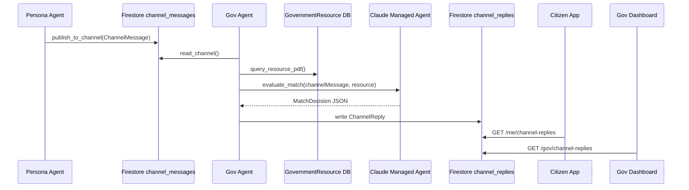

# MATCHA Gov Agent SDD

> SDD = Software Design Document。這份文件說明 Government Agent 要做什麼、為什麼要這樣做、要先做哪些假資料，以及最小可行 pipeline。

## 1. 這個 Agent 要解決什麼問題

MATCHA 的核心想法是「資源主動找到人」，不是讓青年自己去政府網站搜尋。

Gov Agent 負責代表某個政府資源，例如「青年就業促進計畫」、「文組轉職培訓補助」、「職涯探索諮詢」，去監聽 Persona Agent 發出的使用者狀態廣播。當它發現某個使用者可能符合資源條件時，就寫入一筆 `ChannelReply`，讓市民端 Match Inbox 和政府端 Dashboard 都能用 HTTP polling 看到媒合結果。

用一句話說：

> Gov Agent = 會自己找適合使用者的政府資源代理人。

## 2. MVP 範圍

黑客松階段先不要做太複雜。Gov Agent 的 MVP 只需要完成這條主流程：

1. 讀取 Persona Agent 發到 channel 的 `ChannelMessage`
2. 讀取本機關可用的 `GovernmentResource`
3. 把 persona + resource 交給 Claude Managed Agent 判斷媒合
4. 讓 Claude 回傳固定 JSON，包含 `eligible`、`score`、`reason`、`missingInfo`
5. 如果分數夠高，寫入 `ChannelReply`
6. 市民端透過 `GET /me/channel-replies` 看到 Match Inbox
7. 政府端透過 `GET /gov/channel-replies` 看到 Dashboard
8. 真人承辦人按「開啟對話」後，才由 API 建立 `human_threads`

暫時可以不做：

- 完整 RAG 向量搜尋
- Firebase FCM 推播
- 多 Agent 排程系統
- 複雜的政府權限控管

這一版會直接用 `claude-haiku-4-5` 做媒合判斷，不用簡單規則代替。Pipeline 本身只負責資料流、呼叫 Claude Managed Agent、解析結果，並寫入或回傳 `ChannelReply`。

## 3. Gov Agent 在系統中的位置



Gov Agent 最早只需要做到：

- `read_channel`
- `query_resource_pdf`
- `init_managed_agent`
- `evaluate_match_with_claude`

等這四件事能跑，再接：

- `write_channel_reply`
- Match Inbox polling handoff
- `reply_if_asked`
- `summarize_thread`

### 3.1 Markdown Skill-first 原則

本文件中 `skill` 統一指 **Markdown Skill**，也就是放在 `skills/<skill_name>/SKILL.md` 的能力說明文件。它不是 TypeScript function，也不是 MCP tool。

Gov Agent 盡量不要直接在 agent prompt 或 pipeline 裡寫死資料存取邏輯。建議把所有「會碰外部世界」的能力都描述成 Markdown Skill，並註冊成 Claude Managed Agent custom tools。Claude 依照 `SKILL.md` 的指引自行決定是否呼叫 custom tool；後端收到 custom tool event 後執行對應 tool wrapper。

也就是：

```txt
Gov Agent 負責：
- 理解 persona
- 理解政府資源
- 判斷是否媒合
- 決定下一步要呼叫哪個 skill

Markdown Skill 負責：
- 說明何時使用這個能力
- 定義 input / output contract
- 告訴 Agent 應該呼叫哪個 custom tool
- 說明錯誤處理與注意事項

Custom Tool 負責：
- 讓 Claude Managed Agent 可以自主發出 tool call
- 將 `agent.custom_tool_use` 交給後端處理
- 等待後端回傳 `user.custom_tool_result`

Tool Wrapper 負責：
- 執行 TypeScript function
- 讀 fake data / Firebase / Firestore
- 建立 channel reply 或寫入 Firestore
- 呼叫 RAG 或其他 backend capability
```

這樣做的好處：

- Agent 的推理邏輯和系統 I/O 分離
- 之後要把 fake data 換成 Firebase，只要改 custom tool 背後的 tool wrapper
- 之後要把 custom tool 換成 MCP server，可以保留 Markdown Skill 的語意與 input/output contract
- 每個 tool wrapper 都可以獨立測試與除錯
- Claude Managed Agent 可以專注在「何時呼叫哪個能力」與「如何解讀結果」

### 3.2 Resource-scoped Agent 原則

Gov Agent 的執行單位應該是「單一政府資源」，不是「一個機關代理所有資源」。

也就是：

```txt
rid-youth-career-001 Resource Agent
  -> 只能讀取青年職涯探索諮詢

rid-design-intern-002 Resource Agent
  -> 只能讀取創意產業實習媒合計畫

rid-youth-startup-003 Resource Agent
  -> 只能讀取青年創業輔導與貸款說明
```

多個 Resource Agent 可以共用同一批 Markdown Skills 與 custom tools，但 custom tool wrapper 必須根據 runtime context 或 registry 限制資料範圍。Agent 不應該自己傳入 `resourceId` 來決定要讀哪個資源；後端應該用 `sessionId -> resourceId` 的 mapping 判斷這個 agent 能看到哪份資源。

核心原則：

- Agent 只負責判斷「我的資源要不要媒合這個人」
- Tool wrapper 負責 enforce「這個 agent 只能讀自己的 resource」
- `governmentAgents.json` 記錄 resource-level agent/session 與 `resourceId` 的綁定
- 同一個使用者可能同時被多個資源 agent 判斷適合，後續再由 threshold、dedupe 或 ranking 處理

## 4. 會用到的 shared types

目前專案的共用型別放在：

```txt
packages/shared-types/src/index.ts
```

Gov Agent 會主要用到這幾個型別：

```ts
import type {
  ChannelMessage,
  GovernmentResource,
  ChannelReply,
} from '@matcha/shared-types'
```

### 4.1 ChannelMessage

`ChannelMessage` 是 Persona Agent 發到中央頻道的去識別化使用者狀態，也是 Gov Agent pipeline 的直接輸入。

```ts
export interface ChannelMessage {
  msgId: string
  uid: string
  summary: string
  publishedAt: number
}
```

Gov Agent 不需要知道使用者全部個資，只要讀這份摘要即可。

欄位意思：

- `msgId`：channel message id，之後可以用來 dedupe 或追蹤來源。
- `uid`：使用者 id，之後查詢 Match Inbox 或開啟真人對話時會用到
- `summary`：Persona Agent 整理出的自然語言摘要
- `publishedAt`：廣播時間，避免重複處理舊資料

### 4.2 GovernmentResource

`GovernmentResource` 是政府端建立的資源資料。

```ts
export interface GovernmentResource {
  rid: string
  agencyId: string
  agencyName: string
  name: string
  description: string
  eligibilityCriteria: string[]
  contactUrl?: string
  createdAt: number
}
```

欄位意思：

- `rid`：資源 id，例如 `rid-youth-career-001`
- `agencyId`：機關 id，例如 `taipei-youth-dept`
- `agencyName`：機關名稱
- `name`：資源名稱
- `description`：資源說明
- `eligibilityCriteria`：申請條件或適用對象
- `contactUrl`：申請或說明頁
- `createdAt`：建立時間

### 4.3 ChannelReply

`ChannelReply` 是 Gov Agent 媒合成功後寫入的回覆。它不是聊天 thread，而是 Match Inbox / Gov Dashboard 的列表資料來源。

```ts
export interface ChannelReply {
  replyId: string
  messageId: string
  govId: string
  content: string
  matchScore: number
  createdAt: number
}
```

欄位意思：

- `replyId`：回覆 id，MVP 可用 deterministic id 避免重複媒合。
- `messageId`：來源 `channel_messages/{msgId}`。
- `govId`：回覆的政府資源 id，第一版用 `resource.rid`。
- `content`：Gov Agent 產生的媒合理由，給市民 Match Inbox 和 Gov Dashboard 顯示。
- `matchScore`：Claude 給出的 0 到 100 媒合分數，只供前端顯示與排序參考，不應當成唯一決策依據。
- `createdAt`：reply 建立時間，使用 unix ms。

Gov Agent 寫政府媒合回覆時，固定使用：

```ts
messageId: channelMessage.msgId
govId: resource.rid
content: decision.reason
matchScore: decision.score
```

## 5. 預先要做的東西

在接 Firebase 或 RAG 之前，先建立一份 fake data。這樣可以讓你用 Claude Managed Agent 測完整 pipeline，也讓 mobile / web 組可以先串 UI。

建議先放在：

```txt
services/api/src/agent/gov/fakeData.ts
```

如果資料要共用給 mock server，也可以之後移到 `packages/shared-types` 或 `services/api/src/mock`。

### 5.1 Fake ChannelMessage

```ts
import type { ChannelMessage } from '@matcha/shared-types'

export const fakeChannelMessages: ChannelMessage[] = [
  {
    msgId: 'msg-channel-xiaoya-001',
    uid: 'user-xiaoya-001',
    summary: '中文系大三，對品牌設計、排版和文組轉職有興趣，目前想找實習或職涯探索資源。',
    publishedAt: Date.now() - 60_000,
  },
  {
    msgId: 'msg-channel-ming-002',
    uid: 'user-ming-002',
    summary: '剛退伍，想找穩定工作，對餐飲、門市和政府職訓補助有興趣。',
    publishedAt: Date.now() - 30_000,
  },
  {
    msgId: 'msg-channel-lin-003',
    uid: 'user-lin-003',
    summary: '正在準備創業，想了解青年創業貸款、商業模式輔導和政府補助。',
    publishedAt: Date.now() - 10_000,
  },
]
```

### 5.2 Fake GovernmentResource

```ts
import type { GovernmentResource } from '@matcha/shared-types'

export const fakeGovernmentResources: GovernmentResource[] = [
  {
    rid: 'rid-youth-career-001',
    agencyId: 'taipei-youth-dept',
    agencyName: '臺北市青年局',
    name: '青年職涯探索諮詢',
    description: '提供青年職涯方向探索、履歷健檢、面試準備與一對一職涯諮詢。',
    eligibilityCriteria: ['設籍或就學就業於臺北市', '年齡 18 至 35 歲青年', '對職涯方向或轉職有諮詢需求'],
    contactUrl: 'https://example.gov.taipei/youth-career',
    createdAt: Date.now(),
  },
  {
    rid: 'rid-design-intern-002',
    agencyId: 'taipei-youth-dept',
    agencyName: '臺北市青年局',
    name: '創意產業實習媒合計畫',
    description: '媒合對設計、品牌、內容企劃有興趣的青年進入創意產業實習。',
    eligibilityCriteria: ['大專院校學生或畢業三年內青年', '對設計、品牌、內容產業有興趣', '可投入至少兩個月實習'],
    contactUrl: 'https://example.gov.taipei/design-intern',
    createdAt: Date.now(),
  },
  {
    rid: 'rid-youth-startup-003',
    agencyId: 'taipei-youth-dept',
    agencyName: '臺北市青年局',
    name: '青年創業輔導與貸款說明',
    description: '提供青年創業前期諮詢、商業模式輔導、創業貸款說明與補助資訊。',
    eligibilityCriteria: ['年齡 20 至 45 歲', '有創業構想或已成立公司', '需要資金、商業模式或法規諮詢'],
    contactUrl: 'https://example.gov.taipei/startup',
    createdAt: Date.now(),
  },
]
```

## 6. 最小 Pipeline 設計

第一版 pipeline 仍然不要一開始就接 cron、queue 或 WebSocket，但因為媒合判斷要交給 Claude Managed Agent，所以 pipeline 會是 `async`。

Claude Managed Agents 的概念是：先建立一個 Agent，再建立 Environment，最後建立 Session，之後透過 session events 把任務送進去，並讀取 agent 回傳。這很適合 Gov Agent，因為政府資源媒合屬於背景、非同步、可能長時間持續執行的工作。

參考文件：[Claude Managed Agents overview](https://platform.claude.com/docs/en/managed-agents/overview)。

建議檔案：

```txt
services/api/src/agent/gov/
├── fakeData.ts
├── managedAgent.ts
├── toolWrappers/
│   ├── readChannel.ts
│   ├── queryResourcePdf.ts
│   ├── writeChannelReply.ts
│   └── index.ts
├── skills/
│   ├── read_channel/SKILL.md
│   ├── query_resource_pdf/SKILL.md
│   ├── write_channel_reply/SKILL.md
│   └── escalate_to_caseworker/SKILL.md
└── pipeline.ts
```

目標：

```ts
const sessionId = await initGovManagedAgentSession()
const matches = await runGovAgentPipeline(sessionId, fakeChannelMessages, fakeGovernmentResources)
console.log(matches)
```

先讓它印出 Claude 判斷哪些使用者和哪些政府資源匹配。

### 6.1 Pipeline 流程

```txt
runGovAgentPipeline
  -> channel update received
  -> send channel update to Claude Managed Agent
  -> agent follows uploaded Markdown Skills
  -> agent calls custom tools when needed
  -> backend handles agent.custom_tool_use
  -> backend runs matching tool wrapper
  -> backend returns user.custom_tool_result
  -> agent final answer is match JSON or null
```

每一步的責任要單純：

- `read_channel` Markdown Skill：說明何時呼叫 `read_channel` custom tool
- `read_channel` custom tool：由 Claude 自主呼叫，後端執行 `readChannelToolWrapper`
- `query_resource_pdf` Markdown Skill：說明何時呼叫 `query_resource_pdf` custom tool
- `query_resource_pdf` custom tool：由 Claude 自主呼叫，後端執行 `queryResourcePdfToolWrapper`
- `write_channel_reply` Markdown Skill：說明何時呼叫 `write_channel_reply` custom tool
- `write_channel_reply` custom tool：由 Claude 自主呼叫，後端執行 `writeChannelReplyToolWrapper`
- Pipeline：負責喚醒 agent、處理 custom tool events、收集最後的 match JSON 或 `null`

### 6.2 Step 1：監聽 Persona 廣播

MVP 先不要真的「監聽」。後端用 fake data 模擬 channel update，喚醒 Gov Agent。若 agent 需要更多 channel context，會自行呼叫 `read_channel` custom tool；後端收到後執行 `readChannelToolWrapper`。

```ts
import type { ChannelMessage } from '@matcha/shared-types'

export function readChannelToolWrapper(): ChannelMessage[] {
  return fakeChannelMessages
}
```

之後接 Firestore 時，這個函式才換成：

```ts
export async function readChannelToolWrapper(): Promise<ChannelMessage[]> {
  // TODO: read from Firestore channel_messages
}
```

### 6.3 Step 2：查詢本機關資源資料

第一版讓 `query_resource_pdf` Markdown Skill 指向 `query_resource_pdf` custom tool；後端收到 custom tool event 後，執行 `queryResourcePdfToolWrapper` 從 fake resources 裡面用 `agencyId` 篩選。

```ts
import type { GovernmentResource } from '@matcha/shared-types'

export function queryResourcePdfToolWrapper(agencyId: string): GovernmentResource[] {
  return fakeGovernmentResources.filter(resource => resource.agencyId === agencyId)
}
```

之後接 Firestore 時，這個函式才換成：

```ts
export async function queryResourcePdfToolWrapper(agencyId: string): Promise<GovernmentResource[]> {
  // TODO: query Firestore /resources where agencyId == agencyId
}
```

### 6.4 Step 3：定義 Claude 回傳格式

Claude 不能回傳隨便一段文字，否則程式很難穩定解析。第一版請要求 Claude 只回傳 JSON。

```ts
import type { ChannelMessage, GovernmentResource } from '@matcha/shared-types'

export interface MatchDecision {
  eligible: boolean
  score: number
  reason: string
  missingInfo: string[]
}

export interface MatchAssessment {
  channelMessage: ChannelMessage
  resource: GovernmentResource
  decision: MatchDecision
}
```

欄位意思：

- `eligible`：Claude 判斷是否適合主動媒合
- `score`：0 到 100，顯示給前端的媒合分數
- `reason`：給承辦人和使用者看的推薦理由
- `missingInfo`：還缺哪些資訊才能更確定

### 6.5 Step 4：初始化 Claude Managed Agent

這段參考 `local_test/test.ts` 的寫法：建立 Anthropic client，建立 beta agent，建立 environment，再建立 session。

建議檔案：

```txt
services/api/src/agent/gov/managedAgent.ts
```

```ts
import Anthropic from '@anthropic-ai/sdk'

const client = new Anthropic({
  apiKey: process.env.ANTHROPIC_API_KEY,
})

export async function initGovManagedAgentSession() {
  const agent = await client.beta.agents.create({
    name: 'MATCHA Gov Match Agent',
    model: 'claude-haiku-4-5',
    system: `
你是 MATCHA 的 Government Resource Agent。
你的任務是根據使用者 persona 廣播與政府資源條件，判斷是否應該主動媒合。

請遵守：
1. 不要捏造使用者沒有提供的資料。
2. 如果資格條件缺少關鍵資訊，請填入 missingInfo。
3. score 必須是 0 到 100 的整數。
4. 只有明顯值得主動推薦時 eligible 才能是 true。
5. 只能回傳 JSON，不要使用 markdown，不要加解釋文字。

JSON 格式：
{
  "eligible": true,
  "score": 87,
  "reason": "推薦原因",
  "missingInfo": ["還需要確認的問題"]
}
`,
  })

  const environment = await client.beta.environments.create({
    name: 'matcha-gov-agent-env',
    config: {
      type: 'cloud',
      networking: { type: 'unrestricted' },
    },
  })

  const session = await client.beta.sessions.create({
    agent: agent.id,
    environment_id: environment.id,
    title: 'MATCHA Gov Agent Session',
  })

  return session.id
}
```

注意：

- `ANTHROPIC_API_KEY` 要放在 `.env`
- 這裡使用 `client.beta.agents.create`
- model 指定 `claude-haiku-4-5`
- Claude Managed Agents endpoint 屬於 beta，SDK 會依文件自動處理 beta header
- 實作時不要每次都建立新的 agent / environment / session；應先讀 `general/governmentAgents.json` 重用既有資料，沒有才建立

### 6.6 Step 5：Channel update 喚醒 Agent

```ts
export async function runGovAgentForChannelUpdate(
  sessionId: string,
  channelMessage: ChannelMessage,
  agencyId = 'taipei-youth-dept',
): Promise<GovAgentPipelineResult | null> {
  const stream = await client.beta.sessions.events.stream(sessionId)

  await client.beta.sessions.events.send(sessionId, {
    events: [
      {
        type: 'user.message',
        content: [
          {
            type: 'text',
            text: JSON.stringify({
              task: 'channel_updated',
              agencyId,
              channelMessage,
              instructions: [
                'Use custom tools when needed.',
                'If no resource should respond, return null.',
                'If a match should be proposed, call write_channel_reply first.',
              ],
            }),
          },
        ],
      },
    ],
  })

  // Handle agent.custom_tool_use events:
  // - read_channel -> readChannelToolWrapper
  // - query_resource_pdf -> queryResourcePdfToolWrapper
  // - write_channel_reply -> writeChannelReplyToolWrapper
  // Then send user.custom_tool_result back to the session.

  return matchResultOrNull
}
```

### 6.7 Step 6：處理 custom tool events

Custom tool 執行流程：

```txt
Claude Managed Agent
  -> agent.custom_tool_use(read_channel / query_resource_pdf / write_channel_reply)
Backend pipeline
  -> execute matching tool wrapper
  -> user.custom_tool_result
Claude Managed Agent
  -> final JSON or null
```

### 6.8 Step 7：解析 Claude JSON

```ts
export function parseMatchDecision(rawText: string): MatchDecision {
  const parsed = JSON.parse(rawText) as MatchDecision

  if (typeof parsed.eligible !== 'boolean') {
    throw new Error('Claude response missing eligible')
  }

  if (!Number.isInteger(parsed.score) || parsed.score < 0 || parsed.score > 100) {
    throw new Error('Claude response score must be an integer from 0 to 100')
  }

  if (typeof parsed.reason !== 'string') {
    throw new Error('Claude response missing reason')
  }

  if (!Array.isArray(parsed.missingInfo)) {
    throw new Error('Claude response missing missingInfo')
  }

  return parsed
}
```

如果 Claude 偶爾回傳 markdown code block，可以先在 prompt 裡強調「只能回傳 JSON」。真的遇到問題時，再另外寫清理函式，不要一開始就把 parser 寫太複雜。

### 6.8 Step 7：寫入 channel reply

當 `decision.eligible === true` 且 `decision.score >= 70` 時，就建立一筆 `ChannelReply`。這是 Gov Agent 的責任邊界；`human_threads` 只有在政府真人承辦人從 Dashboard 按「開啟對話」時才建立。

```ts
import type { ChannelReply } from '@matcha/shared-types'

export function writeChannelReplyToolWrapper(assessment: MatchAssessment): {
  reply: ChannelReply
} {
  const now = Date.now()

  const reply: ChannelReply = {
    replyId: `reply-gov-${assessment.resource.rid}-${assessment.channelMessage.msgId}`,
    messageId: assessment.channelMessage.msgId,
    govId: assessment.resource.rid,
    content: assessment.decision.reason,
    matchScore: assessment.decision.score,
    createdAt: now,
  }

  return { reply }
}
```

注意：

- `messageId` 指向來源 `channel_messages/{msgId}`
- `govId` 第一版用 `resource.rid`，讓一個政府資源對應一個 Resource Agent
- 第一版 `replyId` 可以先用 deterministic 字串，避免重複媒合時產生多筆相同資料
- Gov Agent 不直接通知使用者；市民端 Match Inbox 用 HTTP polling 讀 `channel_replies`

### 6.9 Step 8：組合完整 pipeline

```ts
export interface GovAgentPipelineResult {
  assessment: MatchAssessment
  reply: ChannelReply
}

export async function runGovAgentPipeline(
  sessionId: string,
  messages: ChannelMessage[],
  threshold = 70,
): Promise<GovAgentPipelineResult[]> {
  const results: GovAgentPipelineResult[] = []

  for (const message of messages) {
    const result = await runGovAgentForChannelUpdate(sessionId, message)

    if (result && result.assessment.decision.score >= threshold) {
      results.push(result)
    }
  }

  return results
}
```

> 注意：`runGovAgentPipeline` 不再預先列出所有 resource 組合；它只把 channel update 交給 Claude Managed Agent。Agent 依照 Markdown Skill 自己決定是否呼叫 `read_channel`、`query_resource_pdf`、`write_channel_reply` custom tools。

### 6.10 Markdown Skill contract 設計

每個 Markdown Skill 都要有固定 input/output，並明確說明要呼叫哪個 custom tool。

#### `read_channel`

用途：讀取 Persona Agent 發布的使用者廣播。

Input：

```ts
interface ReadChannelInput {
  since?: number
  limit?: number
}
```

Output：

```ts
interface ReadChannelOutput {
  messages: ChannelMessage[]
}
```

Markdown Skill：

```txt
skills/read_channel/SKILL.md
```

Tool target：

```txt
read_channel skill -> readChannelToolWrapper -> fakeData.ts
```

之後實作：

```txt
read_channel skill -> readChannelToolWrapper -> Firestore channel_messages
```

或：

```txt
read_channel skill -> MCP tool -> Firestore channel_messages
```

#### `query_resource_pdf`

用途：查詢這個 Resource Agent 綁定的單一政府方案資料。

Input：

```ts
interface QueryProgramDocsInput {
  includeDetails?: boolean
}
```

`agencyId` 與 `resourceId` 不由 Agent input 決定。後端在處理 custom tool event 時，應該從 runtime context 或 registry 取得這個 session 綁定的 `resourceId`，並只回傳該資源。

Output：

```ts
interface QueryProgramDocsOutput {
  resources: GovernmentResource[]
}
```

Markdown Skill：

```txt
skills/query_resource_pdf/SKILL.md
```

Tool target：

```txt
query_resource_pdf skill -> queryResourcePdfToolWrapper -> fakeData.ts
```

之後實作：

```txt
query_resource_pdf skill -> queryResourcePdfToolWrapper -> Firestore gov_resources/{rid}.pdfText
```

RAG 版：

```txt
query_resource_pdf skill -> MCP tool -> vector DB / policy docs
```

#### `write_channel_reply`

用途：根據 Claude 的 `MatchDecision` 寫入 `channel_replies`，讓市民端 Match Inbox 和政府端 Dashboard 可以查到媒合結果。

Input：

```ts
interface WriteChannelReplyInput {
  assessment: MatchAssessment
}
```

Output：

```ts
interface WriteChannelReplyOutput {
  reply: ChannelReply
}
```

Markdown Skill：

```txt
skills/write_channel_reply/SKILL.md
```

Tool target：

```txt
write_channel_reply skill -> writeChannelReplyToolWrapper -> create deterministic ChannelReply
```

之後實作：

```txt
write_channel_reply skill -> writeChannelReplyToolWrapper -> Firestore channel_replies
```

#### Match Inbox polling

Gov Agent 不需要 `notify_user` skill。新版產品流裡，配對通知與新 thread discovery 都靠 HTTP polling。

市民端：

```txt
GET /me/channel-replies
```

政府端：

```txt
GET /gov/channel-replies
```

#### `escalate_to_caseworker`

用途：資格不明、需要人工判斷、或使用者問題超出 Agent 能力時，交給政府承辦人。

Input：

```ts
interface EscalateToCaseworkerInput {
  threadId: string
  reason: string
  summary: string
}
```

Output：

```ts
interface EscalateToCaseworkerOutput {
  escalated: boolean
  govPresence: 'human' | 'both'
}
```

## 7. 第一版檔案規劃

建議新增這些檔案：

```txt
services/
└── api/
    └── src/
        └── agent/
            └── gov/
                ├── fakeData.ts
                ├── managedAgent.ts
                ├── pipeline.ts
                ├── toolWrappers/
                │   ├── readChannel.ts
                │   ├── queryResourcePdf.ts
                │   ├── writeChannelReply.ts
                │   └── index.ts
                ├── skills/
                │   ├── read_channel/
                │   │   └── SKILL.md
                │   ├── query_resource_pdf/
                │   │   └── SKILL.md
                │   ├── write_channel_reply/
                │   │   └── SKILL.md
                │   └── escalate_to_caseworker/
                │       └── SKILL.md
                └── README.md
```

### 7.1 `fakeData.ts`

放：

- `fakeChannelMessages`
- `fakeGovernmentResources`

### 7.2 `pipeline.ts`

放：

- `evaluateMatchWithClaude`
- `parseMatchDecision`
- `runGovAgentPipeline`

Pipeline 不應該直接碰 Firebase、Firestore 或 WebSocket。它只負責：

- 依照 Markdown Skill 的 contract 呼叫 tool wrappers
- 把資料送進 Claude Managed Agent
- 解析 Claude JSON
- 根據 `eligible` 和 `score` 決定是否呼叫 `write_channel_reply`

### 7.3 `managedAgent.ts`

放：

- `initGovManagedAgentSession`
- Anthropic client 初始化
- Gov Agent system prompt
- Claude Managed Agent session 建立邏輯

### 7.4 `skills/`

放 Markdown Skill。`skill` 只用來指稱這種 `SKILL.md` 文件，不用來指 TypeScript wrapper。

建議：

```txt
skills/read_channel/SKILL.md
skills/query_resource_pdf/SKILL.md
skills/write_channel_reply/SKILL.md
skills/escalate_to_caseworker/SKILL.md
```

Markdown Skill 的責任是描述能力、input/output、該呼叫的 custom tool，以及錯誤處理規則。

### 7.5 `toolWrappers/`

放 TypeScript tool wrapper。這層才是真正執行資料讀寫或副作用的程式碼。

建議：

```txt
toolWrappers/readChannel.ts        -> 現在讀 fake data，未來讀 Firestore channel_messages
toolWrappers/queryResourcePdf.ts   -> 現在讀 fake data，未來讀 Firestore / RAG
toolWrappers/writeChannelReply.ts  -> 現在 create ChannelReply，未來寫 Firestore channel_replies
toolWrappers/index.ts              -> 統一 export
```

### 7.6 未來 MCP server 位置

如果後面真的要把 Firebase / RAG 包成 MCP server，可以新增：

```txt
services/
└── api/
    └── src/
        └── agent/
            └── gov/
                └── mcp/
                    ├── server.ts
                    └── tools/
                        ├── readChannel.ts
                        ├── queryResourcePdf.ts
                        └── writeChannelReply.ts
```

但黑客松 MVP 不需要一開始就寫 MCP server。先讓 Markdown Skill 指向 Claude Managed Agent custom tool，再由後端把 custom tool event 對應到 local tool wrapper。

### 7.7 `README.md`

放這個模組自己的簡短說明，例如：

```md
# Gov Agent

This module reads persona channel messages, sends matching decisions to Claude Managed Agent,
and creates channel replies for Match Inbox polling.
```

## 8. 建議實作順序

### Phase 1：完全不接資料庫，但要接 Claude Managed Agent

目標：在 local console 看到 Claude 回傳的媒合判斷。

1. 建立 `services/api/src/agent/gov/fakeData.ts`
2. 建立 `services/api/src/agent/gov/managedAgent.ts`
3. 建立 `services/api/src/agent/gov/pipeline.ts`
4. 建立 `services/api/src/agent/gov/skills/*/SKILL.md`
5. 建立 `services/api/src/agent/gov/toolWrappers/`
6. 寫 `read_channel` Markdown Skill，指向 `readChannelToolWrapper`
7. 寫 `query_resource_pdf` Markdown Skill，指向 `queryResourcePdfToolWrapper`
8. 寫 `write_channel_reply` Markdown Skill，指向 `writeChannelReplyToolWrapper`
9. 寫 `initGovManagedAgentSession`
10. 寫 `evaluateMatchWithClaude`
11. 寫 `runGovAgentPipeline`
12. 用 `console.log` 確認小雅會被 Claude 判斷適合設計實習或職涯探索資源
13. 寫測試

測試程式大概長這樣：

```ts
import { fakeChannelMessages, fakeGovernmentResources } from './fakeData.js'
import { initGovManagedAgentSession } from './managedAgent.js'
import { runGovAgentPipeline } from './pipeline.js'

async function main() {
  const sessionId = await initGovManagedAgentSession()
  const matches = await runGovAgentPipeline(
    sessionId,
    fakeChannelMessages,
    fakeGovernmentResources,
  )

  console.log(JSON.stringify(matches, null, 2))
}

main().catch(console.error)
```

完成標準：

```txt
小雅 -> 創意產業實習媒合計畫 -> Claude 回傳 eligible=true, score >= 70
阿明 -> 青年職涯探索諮詢或就業相關資源 -> Claude 回傳 eligible=true, score >= 70
小林 -> 青年創業輔導與貸款說明 -> Claude 回傳 eligible=true, score >= 70
```

### Phase 2：接 API route

目標：後端可以透過 API 模擬「channel 更新後觸發 Gov Agent pipeline」。

Phase 2 還不接正式的 `publish_to_channel` 自動觸發。這個階段先做一個開發用 endpoint，讓 Persona Agent 或測試工具把「剛更新的 channel message」傳進後端，後端再把這則 message 交給 Gov Agent 判斷。

也就是先用 HTTP 模擬未來的自動觸發：

```txt
Persona Agent 產生新的 ChannelMessage
  -> POST /gov/agent/run
  -> backend wakes resource-scoped Gov Agent session
  -> Gov Agent 判斷這個 resource 要不要媒合這個 user
  -> 回傳 match 或 null
```

可以新增一個開發用 endpoint：

```txt
POST /gov/agent/run
```

Request body 建議支援：

```json
{
  "resourceId": "rid-design-intern-002",
  "message": {
    "msgId": "msg-001",
    "uid": "user-xiaoya-001",
    "summary": "中文系大三，對品牌設計、排版和文組轉職有興趣，目前想找實習或職涯探索資源。",
    "publishedAt": 1710000000000
  }
}
```

欄位語意：

- `resourceId`：指定要喚醒哪一個 Resource Agent。正式版應由 listener 或 registry 決定；Phase 2 先由 request body 傳入，方便測試單一資源。
- `message`：Persona Agent 剛發布到 channel 的新訊息。這是本次 pipeline 的主要輸入。

如果沒有傳 `message`，可以 fallback 跑 `fakeChannelMessages` 全部資料，作為 demo / smoke test 用途。`broadcast` 欄位只保留作為舊版 Phase 2 文件的暫時相容 alias。

回傳：

```json
{
  "success": true,
  "data": {
    "matches": [
      {
        "reply": {
          "replyId": "reply-gov-rid-design-intern-002-msg-001",
          "messageId": "msg-001",
          "govId": "rid-design-intern-002",
          "content": "使用者明確提到品牌設計、排版與實習需求，符合創意產業實習媒合計畫的服務對象。",
          "matchScore": 90,
          "createdAt": 1710000000000
        },
        "reason": "使用者明確提到品牌設計、排版與實習需求，符合創意產業實習媒合計畫的服務對象。",
        "missingInfo": ["是否可投入至少兩個月實習"]
      }
    ]
  }
}
```

這個 endpoint 只給開發測試用，demo 也可以用它觸發媒合。正式接 `publish_to_channel` 後，channel trigger 不一定需要透過 HTTP 呼叫這支 API，也可以在 backend 內部直接呼叫 `runGovAgentForChannelUpdate()`；但 Phase 2 先保留這個 API 作為手動觸發與除錯入口。

### Phase 3：寫入 Firestore channel_replies

目標：真正建立 `ChannelReply`，讓市民端 Match Inbox 和政府端 Dashboard 都能查到。

需要做：

1. 把 `ChannelReply` 寫到 Firestore `channel_replies`
2. `ChannelReply` 要包含 `messageId`、`govId`、`content`、`matchScore`、`createdAt`
3. `GET /me/channel-replies` 可以查到這筆 reply
4. `GET /gov/channel-replies` 可以查到這筆 reply
5. Gov Agent 不建立 `human_threads`；真人承辦人按「開啟對話」時才由 API 建立

建議內容：

```ts
{
  replyId: `reply-gov-${resource.rid}-${channelMessage.msgId}`,
  messageId: channelMessage.msgId,
  govId: resource.rid,
  content: assessment.decision.reason,
  matchScore: assessment.decision.score,
  createdAt: Date.now(),
}
```

### Phase 4：接 Firestore channel_messages

目標：Persona Agent 更新 persona 後，Gov Agent 能讀到真實廣播。

把：

```ts
readChannel(): ChannelMessage[]
```

改成：

```ts
readChannel(): Promise<ChannelMessage[]>
```

然後從 Firestore `channel_messages` 讀資料。

### Phase 5：接 Match Inbox polling

目標：市民端與政府端用 HTTP polling 發現新媒合，不由 Gov Agent 直接送通知。

Gov Agent 不直接送 `match_notify`：

```txt
Gov Agent writes ChannelReply
Citizen app polls GET /me/channel-replies
Gov dashboard polls GET /gov/channel-replies
Gov staff opens HumanThread only after manual decision
```

WebSocket 只用於真人或 Coffee chat 的即時訊息，不用於新媒合通知。

## 9. 避免重複媒合

如果 Gov Agent 每次執行都把同一個 channel message 和同一個 resource 建立 reply，會產生重複資料。

MVP 可以先用 deterministic `replyId` 避免重複：

```ts
const replyId = `reply-gov-${resource.rid}-${channelMessage.msgId}`
```

真正寫 Firestore 時，建議用一個額外 key：

```txt
matchKey = `${resource.rid}:${channelMessage.msgId}`
```

寫入前先查：

```txt
channel_replies where matchKey == "rid-design-intern-002:msg-channel-xiaoya-001"
```

如果已存在，就不要再建立。

## 10. Claude Managed Agent 設計重點

第一版就使用 Claude Managed Agent，不使用 rule-based scoring。Pipeline 的責任是把 channel update 送進 session、處理 custom tool events，並接收 Agent 最終回傳的 match result 或 `null`；真正的 eligibility、工具使用順序與是否回應交給 `claude-haiku-4-5`。

整體流程：

```txt
channel update
  -> backend wakes Gov Agent session
  -> Claude decides whether to call read_channel
  -> Claude decides whether to call query_resource_pdf
  -> Claude evaluates eligibility and fit
  -> if no response: final answer null
  -> if response: Claude calls write_channel_reply
  -> backend writes/returns ChannelReply
  -> citizen app and gov dashboard discover reply by polling
```

Claude 最終回應必須是 `null` 或固定 JSON：

```json
{
  "respond": true,
  "reply": {}
}
```

如果 `missingInfo` 不為空，Gov Agent 可以把缺少資訊寫進 reply 的內容摘要或保留在 assessment 中，讓前端或後續真人承辦人判斷是否要開啟對話。

### 10.1 為什麼用 Managed Agent

Claude Managed Agents 適合長時間、非同步、有狀態的 Agent 工作。Gov Agent 不是一次問答，而是會持續讀取 persona channel message、判斷多個資源，並寫入可被市民端和政府端查詢的 channel replies。

對 MATCHA 來說，Managed Agent 的好處是：

- 不需要自己先實作完整 agent loop
- session 可以保留上下文
- 適合背景執行與非同步工作
- 之後可以接 MCP tools 或檔案工具
- 可以把 Gov Agent system prompt 固定成政府資源媒合專家

### 10.3 Skill 與 MCP 的演進路線

建議分三層演進，不要一開始就把所有東西都做成 MCP：

```txt
Phase 1: Markdown Skill -> tool wrapper -> fake data
Phase 2: Markdown Skill -> tool wrapper -> Firebase / Firestore / WebSocket
Phase 3: Markdown Skill -> MCP tool -> Firebase / RAG / external services
```

這樣做的原因是：

- Phase 1 可以最快 demo
- Phase 2 可以接真實後端
- Phase 3 才把可重用、跨 Agent 的能力抽成 MCP

Skill 名稱盡量沿用 Agent 語意，不要用資料庫語意：

```txt
Good:
- read_channel
- query_resource_pdf
- write_channel_reply
- expose_to_match_inbox
- escalate_to_caseworker

Avoid:
- getFirebaseRtdbNode
- insertFirestoreDocument
- sendRawWebSocketMessage
```

原因是 Gov Agent 應該思考「我要讀頻道、查資源、提出媒合」，而不是思考「我要操作哪個資料庫」。

### 10.2 Managed Agent Registry 與重用策略

Gov Agent 不應該每次執行都建立新的 Claude Agent / Environment / Session。Phase 1 先用本地 JSON registry 保存可重用資料，之後可換成 Redis 或 Firestore。

```txt
services/api/src/agent/general/
├── governmentAgents.json
├── userAgents.json
└── agentRegistry.ts
```

`governmentAgents.json` 保存目前有哪些政府 Resource Agent。每筆 record 應該綁定一個 `resourceId`：

```json
{
  "agents": [
    {
      "agencyId": "taipei-youth-dept",
      "agencyName": "臺北市青年局",
      "resourceId": "rid-design-intern-002",
      "resourceName": "創意產業實習媒合計畫",
      "agentId": "agent_xxx",
      "environmentId": "env_xxx",
      "model": "claude-haiku-4-5",
      "sessions": [
        {
          "key": "default",
          "sessionId": "session_xxx",
          "title": "MATCHA Gov Resource Agent Session (taipei-youth-dept:rid-design-intern-002:default)",
          "createdAt": 1710000000000,
          "updatedAt": 1710000000000
        }
      ],
      "createdAt": 1710000000000,
      "updatedAt": 1710000000000
    }
  ]
}
```

`userAgents.json` 保存目前有哪些使用者 Agent，結構類似，但用 `uid` 當 key：

```json
{
  "agents": [
    {
      "uid": "user-xiaoya-001",
      "displayName": "小雅",
      "agentId": "agent_xxx",
      "environmentId": "env_xxx",
      "model": "claude-haiku-4-5",
      "sessions": []
    }
  ]
}
```

重用流程：

```txt
initGovManagedAgentSession(agencyId, resourceId)
  -> read governmentAgents.json
  -> find record where agencyId + resourceId match
  -> if agentId + environmentId + sessionId exist for this resource: reuse sessionId
  -> if agentId missing: create Claude Agent and save agentId
  -> if environmentId missing: create Environment and save environmentId
  -> if session missing: create Session and save sessionId
```

Phase 1 使用 JSON registry：

```txt
governmentAgents.json -> long-lived gov resource agent registry
userAgents.json       -> long-lived user agent registry
```

後續正式版可以替換為：

```txt
Redis key: session:gov_agent:{agencyId}:{resourceId}
Firestore collection: agent_registry
```

## 11. 跟其他人的依賴關係

### 11.1 依賴 Persona Agent

你需要 Persona Agent 提供：

- `UserPersona`
- `publish_to_channel`
- 真實或 fake `ChannelMessage`

沒有 Persona 廣播，Gov Agent 沒有輸入。

### 11.2 依賴 shared-types 負責人

你需要確認這些型別不會一直變：

- `ChannelMessage`
- `GovernmentResource`
- `ChannelReply`

如果要加欄位，例如 `matchKey`、`deadline`、`resourceUrl`，要先跟大家講。

### 11.3 依賴政府端 Web

政府端需要能看到：

- `GET /gov/resources`
- `POST /gov/resources`
- `GET /gov/channel-replies`
- match dashboard
- 承辦人開啟對話按鈕

Gov Agent 建立的 reply 必須能在政府端 dashboard 出現。

### 11.4 依賴市民端 Match Inbox

市民端需要能：

- polling `GET /me/channel-replies`
- 顯示 `content`、`matchScore`、resource name
- 在真人 thread 建立後，polling `GET /me/human-threads`

Gov Agent 不直接負責通知使用者；它只負責產生可被 Match Inbox 消化的 `ChannelReply`。

### 11.5 依賴市民端 Mobile

市民端需要能看到：

- Match Inbox
- channel reply detail
- human thread 列表
- 真人對話畫面

否則 Gov Agent 即使寫入 reply，使用者也看不到結果。

### 11.6 依賴 Firebase / Backend 基礎設施

之後正式串接時，你需要：

- Firestore channel_messages collection
- Firestore channel_replies collection
- Firestore gov_resources collection
- Firestore human_threads collection（真人介入後）
- WebSocket client registry（真人 / Coffee chat）
- Firebase Auth middleware

但第一版 fake pipeline 可以先不依賴 Firebase，只需要 `.env` 裡有 `ANTHROPIC_API_KEY`，並能成功建立 Claude Managed Agent session。

### 11.7 依賴 Claude / Anthropic 設定

你需要：

- `@anthropic-ai/sdk`
- `.env` 裡的 `ANTHROPIC_API_KEY`
- 使用 `claude-haiku-4-5`
- 使用 `client.beta.agents.create`
- 使用 `client.beta.environments.create`
- 使用 `client.beta.sessions.create`
- 使用 `client.beta.sessions.events.send`
- 使用 `client.beta.sessions.events.stream`

目前 `local_test/test.ts` 已經有初始化 agent、environment、session、event stream 的範例，可以直接改成 Gov Agent 版本。

## 12. 完成標準

第一階段完成標準：

- 有 `fakeChannelMessages`
- 有 `fakeGovernmentResources`
- 有 `skills/read_channel/SKILL.md`
- 有 `skills/query_resource_pdf/SKILL.md`
- 有 `skills/write_channel_reply/SKILL.md`
- 有對應的 `toolWrappers/`
- 有 `initGovManagedAgentSession`
- 有 `evaluateMatchWithClaude`
- `runGovAgentPipeline` 可以跑
- Claude 能輸出至少 2 筆合理媒合
- 每筆媒合都有 `eligible`、`score`、`reason`、`missingInfo`、`reply`
- 小雅能被 Claude 判斷適合設計 / 實習 / 職涯探索資源

第二階段完成標準：

- `POST /gov/agent/run` 可以觸發 pipeline
- request body 可以傳入單一新的 `ChannelMessage`
- request body 可以指定要測試的 `resourceId`
- 回傳 matches JSON
- 不需要前端也可以用 API 測試

第三階段完成標準：

- pipeline 結果可以把 `ChannelReply` 寫入 Firestore `channel_replies`
- 市民端 `GET /me/channel-replies` 看得到
- 政府端 `GET /gov/channel-replies` 看得到
- Gov Agent 不建立 `human_threads`

## 13. 建議今天先做的最小任務

如果時間有限，照這個順序做：

1. 建 `services/api/src/agent/gov/fakeData.ts`
2. 建 `services/api/src/agent/gov/managedAgent.ts`
3. 建 `services/api/src/agent/gov/pipeline.ts`
4. 建 `services/api/src/agent/gov/skills/*/SKILL.md`
5. 建 `services/api/src/agent/gov/toolWrappers/`
6. 寫 `read_channel` Markdown Skill + `readChannelToolWrapper`
7. 寫 `query_resource_pdf` Markdown Skill + `queryResourcePdfToolWrapper`
8. 寫 `write_channel_reply` Markdown Skill + `writeChannelReplyToolWrapper`，輸出 `ChannelReply`
9. 寫 `initGovManagedAgentSession`
10. 寫 `evaluateMatchWithClaude`
11. 寫 `parseMatchDecision`
12. 寫 `runGovAgentPipeline`
13. 用 console 確認 Claude 回傳 fake matches
14. 再接 `POST /gov/agent/run`

不要一開始就接 Firebase 或 RAG。先用 fake data + Claude Managed Agent 讓媒合判斷跑起來，demo 才會穩。
